# FUNDAMENTOS DE LOS SISTEMAS INFORMÁTICOS Y LAS MÁQUINAS VIRTUALES
* [Arquitectura de un sistema informático. Modelos](#arquitectura-modelos)
* [Componentes hardware de un sistema informático](#componentes-hardware)
* [Controladores de dispositivos. Instalación de drivers](#dispositivos)
* [Componentes software de un sistema informático](#software)
* [Proceso de arranque de un sistema informático. POST](#post)
* [Máquinas virtuales](#maquina-virtual)
* [Normas de seguridad y prevención de riesgos laborales](#seguridad)

<h2 id="arquitectura-modelos"><u>Arquitectura de un sistema informático. Modelos</u></h2>

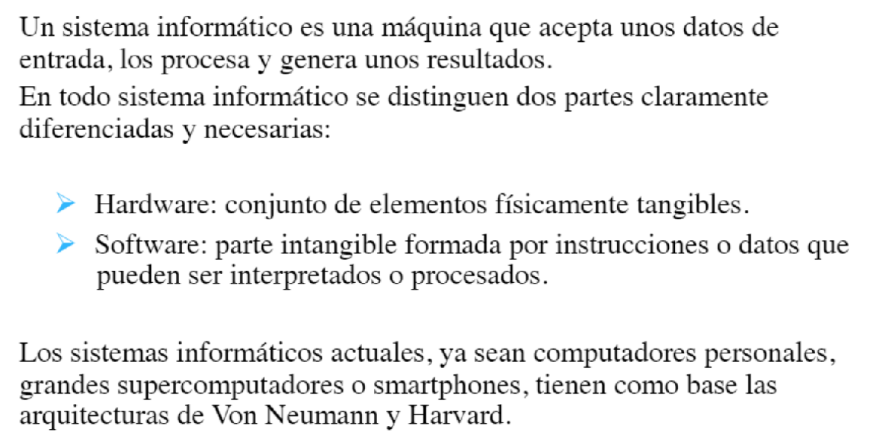

### Funcionamiento de un computador
#### <u>Modelo 1: La arquitectura de Von Neumann</u>
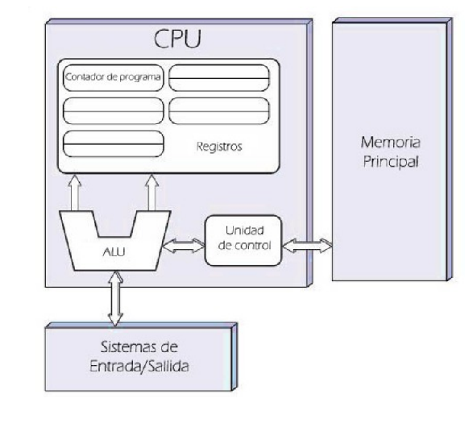

- **<u>Componentes del computador</u>**
  * La unidad aritmético-lógica (ALU) es un circuito digital que calcula operaciones aritméticas (como suma, resta, multiplicación, etc.) y operaciones lógicas (si, y, o, no) entre dos números.
  * La unidad de control es la circuitería que controla el flujo de   datos a través del procesador, y coordina el procesador, que a su vez controla el resto del PC.
    * Las salidas de la unidad de control se encargan de controlar la actividad del resto del dispositivo.
    * Las entradas de la unidad de control son las señales enviadas por los dispositivos con el resultado de la actividad que ha sucedido.
  * El registro es una memoria de alta velocidad y poca capacidad, integrada en el microprocesador, que permite guardar transitoriamente y acceder a valores muy usados, generalmente en operaciones matemáticas.
  * La memoria principal se utiliza como memoria de trabajo para el sistema operativo, los programas y la mayoría del software. Es allí donde se cargan todas las instrucciones que ejecutan el procesador y otras unidades de cómputo.
  * Los dispositivos de entrada/salida son los aparatos y/o dispositivos auxiliares e independientes conectados a la unidad central de procesamiento de una computadora, que proporcionan un medio de transporte de los datos entre las distintas partes. 
  
- **<u>Funcionamiento de un computador</u>**
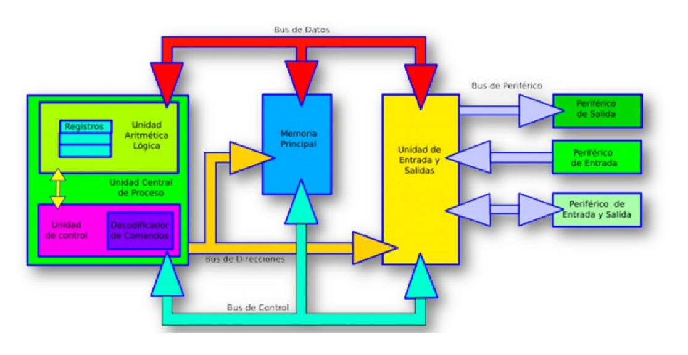

- **<u>Arquitectura de Von Neumann [Video]:</u>**
[https://www.youtube.com/watch?v=KpAHKQrco_s](https://www.youtube.com/watch?v=KpAHKQrco_s)

  * Leer la instrucción:
    * La UC detecta cual es la instrucción a realizar y se la solicita a la memoria principal.
    * La memoria principal transfiere la instrucción al registro.
    * Si existe algún dato necesario para realizar la instrucción, también se envía al registro.
  * Ejecutar la instrucción:
    * La Unidad de Control envía la instrucción y los datos necesarios a la ALU.
    * La ALU ejecuta la instrucción y obtiene el resultado.
    * La UC envía el resultado a la memoria principal y lee cual es la siguiente instrucción, iniciando el ciclo de nuevo.

- **<u>Como trabaja el procesador [Video]</u>:**
[https://www.youtube.com/watch?v=b5mZKUTQ3JQ](https://www.youtube.com/watch?v=b5mZKUTQ3JQ)

#### <u>Modelo 2: Arquitectura de Harvard</u>
  * La principal diferencia entre las dos arquitecturas es que en una arquitectura de Von Neumann toda la memoria es capaz de almacenar todos los elementos del programa, datos e instrucciones; en una arquitectura de Harvard la memoria se divide en dos memorias, una para datos y otra para instrucciones.
  * División de la memoria en una memoria de instrucciones y una memoria de datos, permite que el procesador puede acceder separada y simultáneamente a las dos memorias
  * **Von Neumann vs Harvard [Video]:** [https://www.youtube.com/watch?v=uPNgjj2a3xE](https://www.youtube.com/watch?v=uPNgjj2a3xE)

    

  * **<u>La jerarquía de la memoria</u>**
    * Cantidad
    * Velocidad
    * Coste
  
  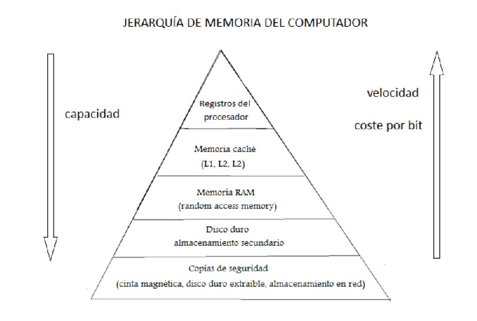

  * Como puede esperarse los tres factores compiten entre sí, por lo que hay que encontrar un equilibrio.
    * A menor tiempo de acceso mayor coste económico.
    * A mayor capacidad de almacenamiento menor coste económico por bit.
    * A mayor capacidad de almacenamiento menor velocidad de transferencia.

* **<u>Niveles de jerarquía</u>**
  * Registro CPU: son memorias de baja capacidad pero de alta velocidad, integradas en el procesador, que permiten guardar y acceder a valores muy usados.
  * Memoria caché: de baja capacidad, muy rápidas, permite acelerar el acceso a los datos, trasladándolos a un medio más rápido cuando se supone que van a leerse o a modificarse pronto.
  * Memoria RAM: es más lenta y de mayor capacidad que la caché.
  * Memoria secundaria o de disco: estas son de alta capacidad y lo forman los discos duros del ordenador, tanto internos como externos, donde se almacenan todos los programas y archivos para un uso posterior.

  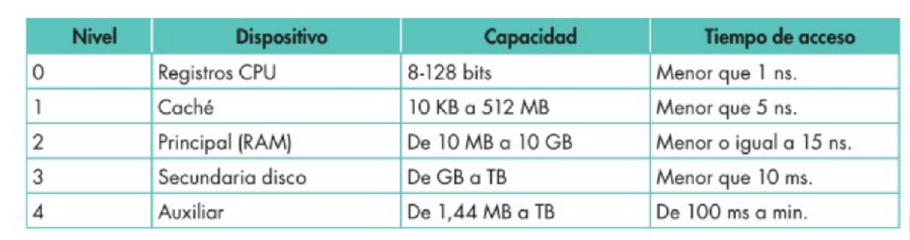

  ## Actividad 1
  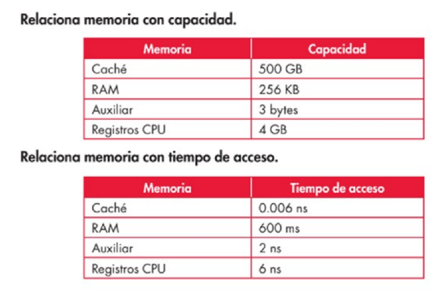
  
  ## Solución 1
  

    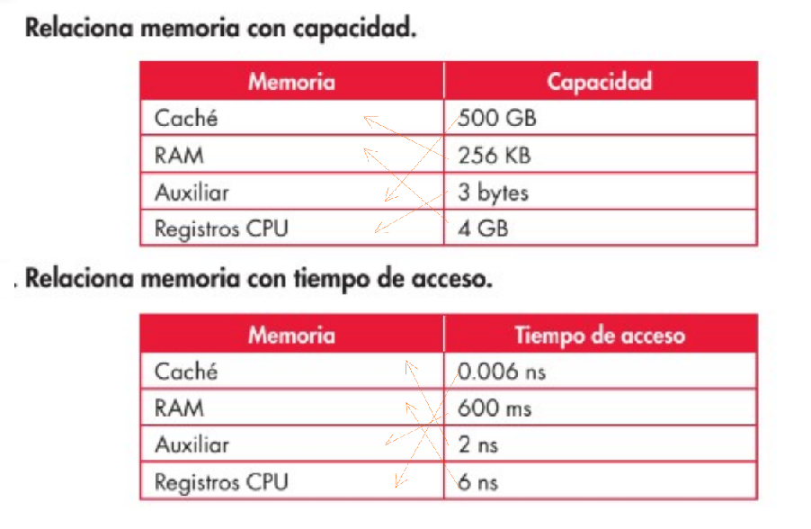

  

  ## Actividad 2
  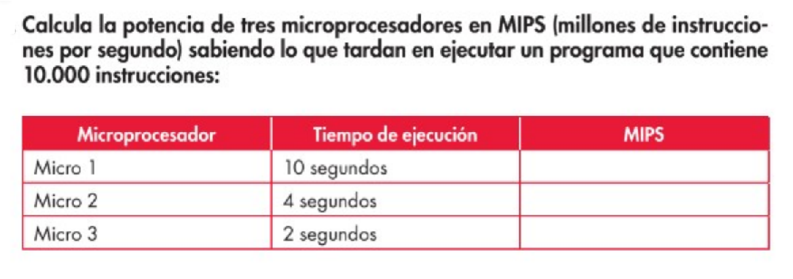
  
  ## Solución 2
  

  
    MIPS = (10,000 instrucciones / 10 segundos) / 1,000,000
    MIPS = (1,000 instrucciones por segundo) / 1,000,000
    MIPS = 0.001 MIPS
    Entonces, la potencia del microprocesador en MIPS es de 0.001 MIPS, lo que significa que puede ejecutar 0.001 millones de instrucciones por segundo.

    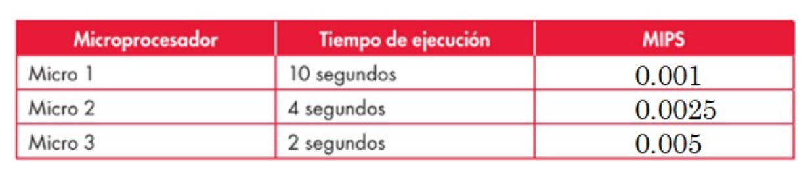

  

&nbsp;

* **<u>MEDIDAS DE LA INFORMACIÓN</u>**
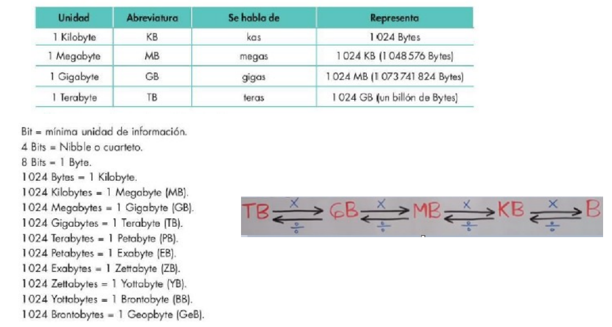

**Convertir entre medidas [Video]:** 
[https://www.youtube.com/watch?v=IEg_5sjhw-8](https://www.youtube.com/watch?v=IEg_5sjhw-8)

## Actividad 3
  - Suponiendo caracteres de 8 bits
  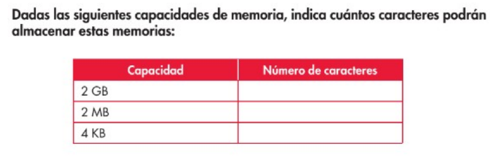

##  Solución 3
  
 Suponiendo caracteres de 8 bits (1 byte):
  2GB se traduce a 2,147,483,648 bytes
  Cantidad de caracteres = Capacidad de la memoria (en bytes) / Tamaño de un carácter (en bytes)
  Cantidad de caracteres = 2,147,483,648 bytes / 1 byte (carácter)
  Cantidad de caracteres ≈ 2,147,483,648 caracteres

  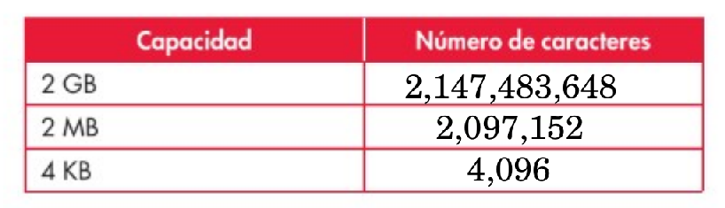

  

## Actividad 4
  - Transformar estas cantidades a KB, MB, GB y TB.
    > Importante: Para realizar 1a equivalencia de unas medidas de información con otras, tendremos siempre en cuenta la medida a la que llegar y la medida de la que partimos

      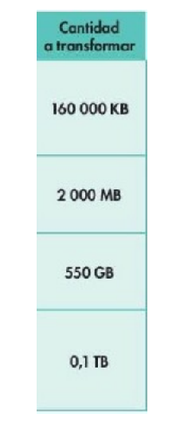

## Solución 4
  

    
  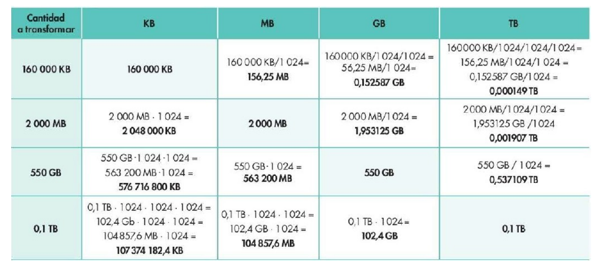

  

<h2 id="componentes-hardware"><u>Componentes hardware de un sistema informático</u></h2>

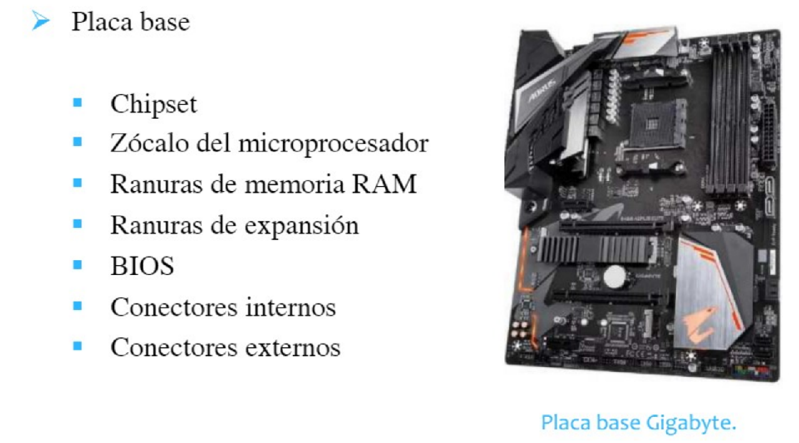
* Placa base
  * La placa base (mainboard) o placa madre (motherboard) es el elemento principal del ordenador; a ella se conectan todos los demás dispositivos, como pueden ser el disco duro, la memoria o el microprocesador, y hace que todos estos componentes funcionen en equipo. De ella dependerán los componentes que podremos instalar y las posibilidades de ampliación del ordenador.

  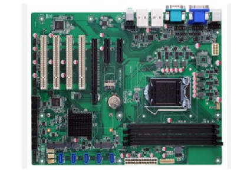

  * Hay una gran variedad de formas, tamaños y tipos de placas base. El factor de forma de la placa base determina el tamaño y orientación de la placa con respecto a la caja, el tipo de fuente de alimentación necesaria y dicta los periféricos que pueden integrarse en la placa.

### <u>Actividad Entregable</u>
> Buscar las dimensiones y características de cada una de estos factores de forma y nombra algún otro tipo de factor de forma que no esté entre la lista con sus dimensiones
>   * ATX, Mini-ATX y Micro-ATX
>   * LPX y NLX
>   * BTX
>   * Mini-ITX, Nano-ITX y Pico-ITX
>   * También podemos encontrar otros factores de forma como: 
>     * DTX / Mini-DTX
>     * Micro-BTX / Pico-BTX
>     * ETX / Nano-ETX / XTX
> 
> Nota: Si las medidas están en pulgadas, tener en cuenta que 2,54 cm equivalen aproximadamente a una pulgada
  
<!-- 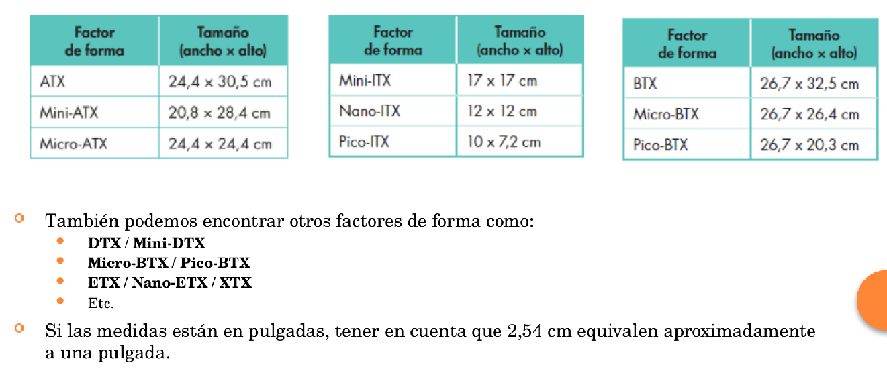 -->

### <u>Componentes Placa base</u>
* **Zócalo del microprocesador**: es el conector en el que se inserta el microprocesador o CPU
* **Ranuras de memoria**: son los conectores donde se instala la memoria principal del ordenador, la memoria RAM. También se los llama bancos de memoria.
* **Chipset**: se encarga de controlar muchas de las funciones que se llevan a cabo en el ordenador, como, por ejemplo, la transferencia de datos entre la memoria, la CPU y los dispositivos periféricos.
* **La BIOS**: el Sistema Básico de Entrada/Salida (Basic Input/Output System) es un pequeño conjunto de programas almacenados en una memoria que permiten que el sistema se comunique con los dispositivos durante el proceso de arranque.
* **Ranuras de expansión o slots**: son las ranuras donde se introducen las tarjetas de expansión.
* **Conectores externos**: permiten que los dispositivos externos se comuniquen con la CPU, como, por ejemplo, el teclado o el ratón.
* **Conectores internos**: son los conectores para los dispositivos internos, como el disco duro, la unidad de DVD, etc.
* **Conectores de energía**: a los que se conectan los cables de la fuente de alimentación para que la placa base y otros componentes reciban la electricidad.
* **La batería**: gracias a ella, se puede almacenar la configuración del sistema usada durante la secuencia de arranque del ordenador, como la fecha, la hora, los parámetros de la BIOS, etc.
* **Conectores y componentes de una placa base**  [Video] [https://www.youtube.com/watch?v=bDcdrc2AD5k](https://www.youtube.com/watch?v=bDcdrc2AD5k)

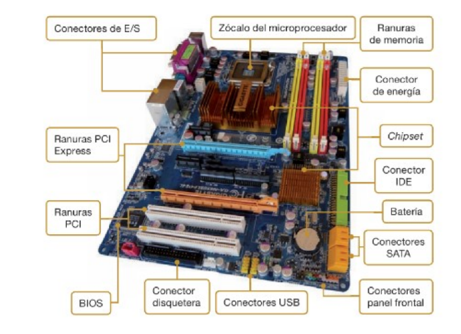

* ### Zócalo del microprocesador
  * Es el conector en el que se inserta el microprocesador. Este ha evolucionado desde la aparición de los primeros microprocesadores para PC, donde el micro se soldaba a la placa base o se insertaba en el zócalo y no se podía sacar, hasta los conectores actuales, en los que es fácil cambiar el micro.
    * **<u>ZIF (Zero Insertion Force)</u>**. En este tipo de zócalo, el micro se inserta y se retira sin necesidad de hacer presión. La palanca que hay al lado del zócalo permite introducirlo sin hacer presión, lo que evita que se puedan doblar las patillas. Una vez colocado, al levantar la palanca el micro se liberará sin ningún problema.
    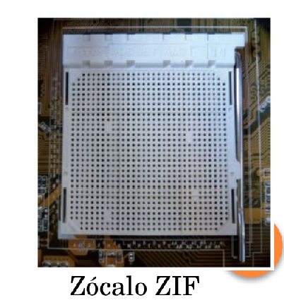
    * **<u>LGA (Land Grid Array)</u>**. En este tipo de zócalo, los pines están en la placa base en lugar de estar en el micro,mientras que el micro tiene contactos planos en su parte inferior. Esto permitirá un mejor sistema de distribución de energía y mayores velocidades de bus. Con este tipo hay que tener en cuenta la fragilidad de los pines, si se dobla alguno es difícil enderezarlo.
    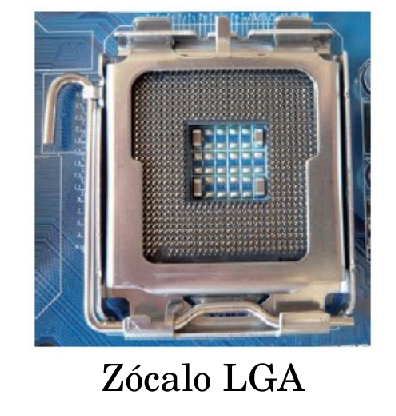
    * **<u>BGA (Ball Grid Array)</u>**. En este caso tenemos en lugar de pines existen unas bolitas de cobre que se sueldan directamente a la placa base. Elimina cualquier posibilidad  de ampliación o sustitución del microprocesador.
    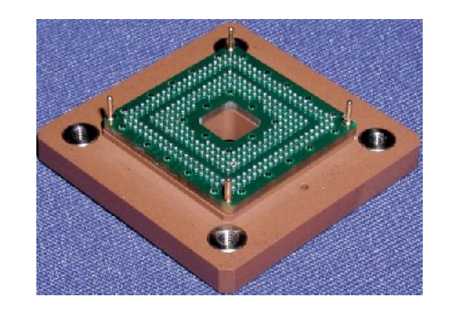
    * **<u>Slot</u>**: Totalmente diferente a los anteriores. Se trata de un rectángulo similar a las ranuras de expansión. Utiliza  contactos (y no pines como los anteriores) para la transmisión de datos y electricidad. Se ayuda de unas pestañas de sujeción laterales para que no se mueva. Está obsoleto, sólo lo utilizó Intel en los microprocesadores Celeron, Pentium II y Pentium III.
    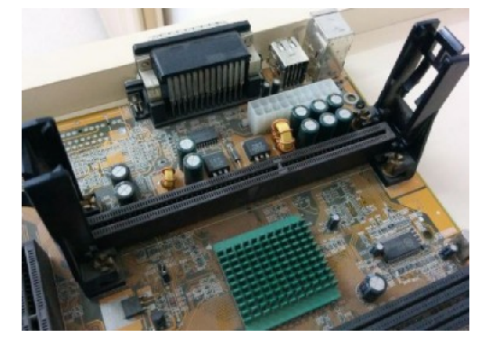

- #### Número de zócalos
  * Monoprocesador: Placa base que posee un sólo zócalo.
  * Multiprocesador: Placa base que posee varios zócalos.

  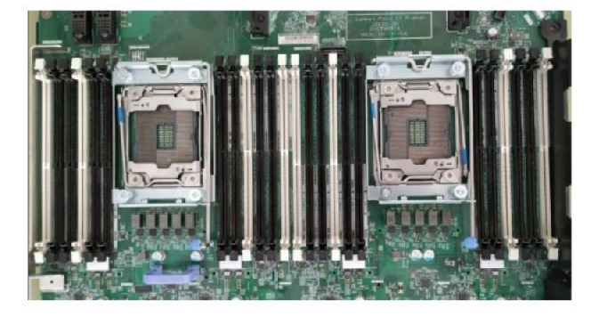

## Actividad 1
- Infórmate de los procesadores INTEL y AMD como han evolucionado respecto al tipo de zócalo
<!-- https://es.wikipedia.org/wiki/Anexo:Z%C3%B3calos -->

* ### Chipset
* El chipset es un conjunto de circuitos lógicos (chips) que ayudan a que el procesador y los componentes del PC se comuniquen con los dispositivos conectados a la placa base y los controlen. Realiza las siguientes funciones:
  * Controla la transmisión de datos, las instrucciones y las señales de control que fluyen entre la CPU y el resto de elementos del sistema.
  * Maneja la transferencia de datos entre la CPU, la memoria y los dispositivos periféricos.
  * Ofrece soporte para el bus de expansión (más conocido como ranuras de entrada/salida).
* El chipset suele constar de dos chips, denominados northbridge y southbridge. El nombre de los chips del chipset se debe a su posición física en las placas que se montan verticalmente. El situado en la parte superior, es decir, más «al norte», es el northbridge, el situado más abajo «al sur» es el southbridge

  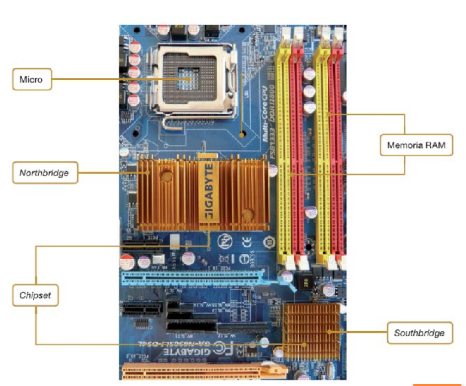

#### COMPONENTES PLACA BASE
* **Chipset - NORTHBRIDGE**
  * El ***northbridge*** suele ser más grande que el southbridge y podemos encontrarlo en las placas base con un disipador o incluso un ventilador, ya que trabaja a velocidades muy elevadas.
  * Es el responsable de la conexión del bus frontal de la CPU con los componentes de alta velocidad del sistema, como son la memoria RAM y el bus PCI Express. Controla las funciones de acceso desde y hacia el microprocesador, la memoria RAM y el puerto PCI Express (para las tarjetas gráficas) y las comunicaciones con el southbridge.
  * La tendencia es a la desaparición de este chipset, ya que sus funciones están siendo integradas en la arquitectura de los nuevos microprocesadores
  * El chip Northbridge controla las siguientes características del sistema
    * Tipo de microprocesador que soporta la placa.
    * Número de microprocesadores que soporta la placa.
    * Velocidad del microprocesador.
    * La velocidad del bus frontal FSB.
    * Controlador de memoria.
    * Tipo y cantidad máxima de memoria RAM soportada.
    * Controladora gráfica integrada (solo algunos northbridge).

    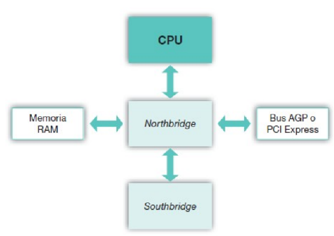

* **Chipset - SOUTHBRIDGE**
  * Es el responsable de la conexión de la CPU con los componentes más lentos del sistema. Algunos de estos componentes son los dispositivos periféricos. El Southbridge no está conectado a la CPU y se comunica con ella indirectamente a través del Northbridge.
  * El chip Southbridge ofrece las siguientes características:
    * Soporte para buses de expansión, como los PCI.
    * Controladores de dispositivos: IDE, SATA, de red Ethernet y de sonido.
    * Control de puertos para periféricos: USB o FireWire.
    * Funciones de administración de energía.
    * Controlador del teclado, de interrupciones, controlador DMA (Direct Memory Access, acceso directo a memoria).
    * Controladora de sonido, red y USB integrados (solo algunos
    southbridge).

* **BIOS**
  * La BIOS (Basic Input/Output System, Sistema Básico de Entrada/Salida) es un conjunto de programas muy elementales, grabados en un chip de la placa base denominado ROM BIOS que se encarga de realizar las funciones necesarias para que el ordenador arranque.

    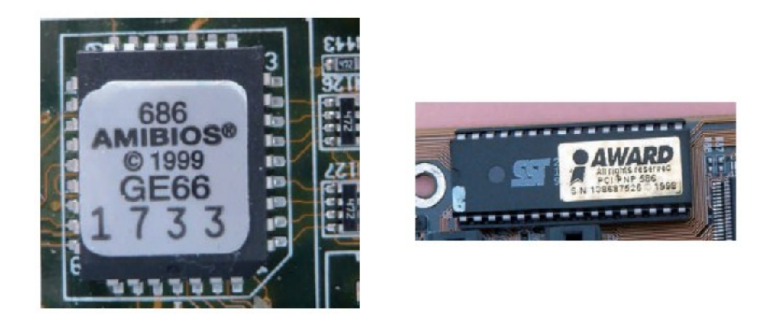

  * Los pasos que realiza la BIOS en el proceso de arranque son los siguientes:
    * Lo primero que hace la BIOS es un chequeo de todos los componentes de hardware. Si encuentra algún fallo, avisa mediante un mensaje en la pantalla o con pitidos de alarma. Algunas placas base incorporan indicadores luminosos que permiten diagnosticar cuándo se produce el error. Este chequeo o test se llama POST (Power On Self Test, autocomprobación al conectar).
    * Si el proceso POST no encuentra problemas, el proceso de arranque continúa.
    * Después de esto viene la información de la propia BIOS, que se refiere al fabricante y a la versión.

    * Siguientes pasos:
      * La BIOS inicia una serie de pruebas del sistema incluida la cantidad de memoria
      * RAM detectada en el sistema
      * A continuación, la BIOS comprueba los dispositivos que están presentes con sus características; por ejemplo, unidades de disco, CD-ROM.
      * Si la BIOS soporta la tecnología plug-and-play,  es decir, si es un PnP BIOS, todos los dispositivos detectados se configuran.
      * Al final de la secuencia, la BIOS presenta una pantalla de resumen de datos. Ahora le toca actuar al sistema operativo.

  * En los ordenadores más antiguos, la BIOS, que era conocida como ROM BIOS, no se podía modificar. En los actuales sí se puede reescribir entrando en el llamado Setup de la BIOS; a esta utilidad se la conoce con el nombre BIOS/CMOS Setup Utility o Programa de Ayuda de Configuración CMOS, ya que los parámetros de configuración básica se escriben en una memoria CMOS.
  * La CMOS se alimenta permanentemente de una batería que suele tener forma de botón de este modo, los valores almacenados se mantienen incluso si se apaga el ordenador.

    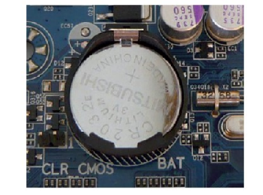

* **CONECTORES DE ENERGÍA**
  * Estos conectores sirven para conectar los cables de la fuente de alimentación a la placa base; de esta manera, la placa base suministrará la corriente a los componentes que se conectan a ella, como el microprocesador, la memoria, las tarjetas de expansión, los ventiladores, etc.
  * Algunos de ellos son el conector ATX de 12 V de 4 pines o el conector ATX de 24 pines.
  * El conector auxiliar de 8 pines puede venir separado en dos bloques de 4 o como un único conector. Se reconoce por sus cables de color negro y amarillo

    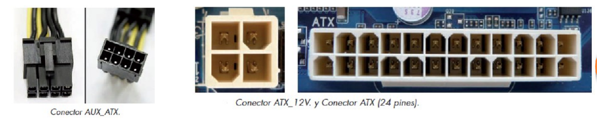

* **CONECTORES INTERNOS**

  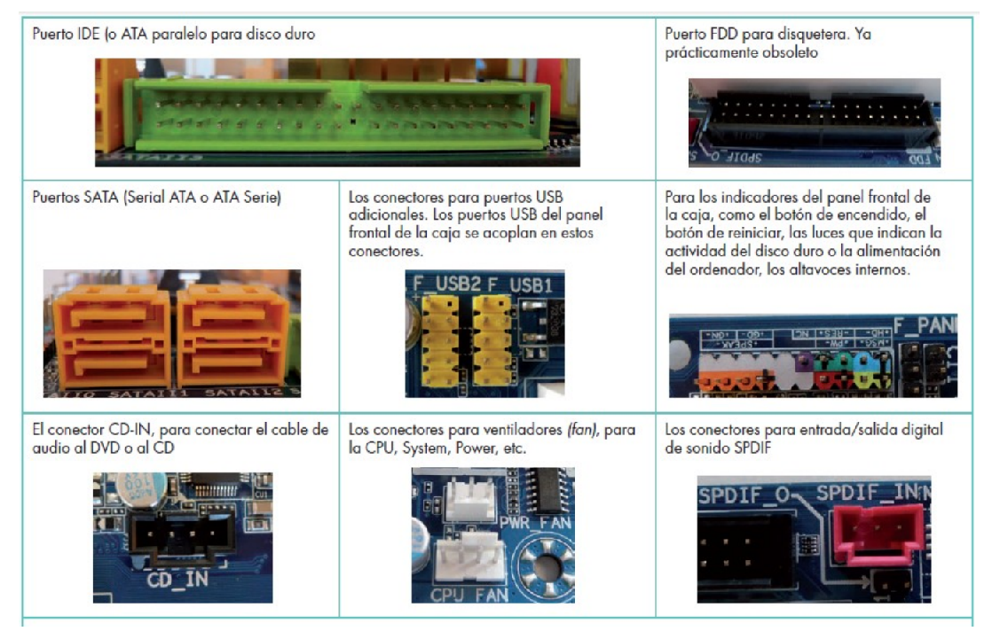

* **RANURAS DE EXPANSIÓN**
  * Las ranuras de expansión o slots de expansión son las zonas o conectores que sirven de interfaz entre la placa base y el resto de tarjetas que se conectan directamente (por ejemplo, tarjeta de sonido, tarjeta gráfica, tarjeta capturadora de vídeo...). Los nombres y tecnologías de las ranuras de expansión van asociados a los buses correspondientes:
    * ***PCI***: Peripheral Component Interconnect (en español: Interconexión de Componentes Periféricos), es un bus estándar de computadoras para conectar dispositivos
    periféricos directamente a la placa base. Es la versión antigua del PCI Express. Su uso es limitado a unos pocos dispositivos como tarjetas gráficas o de video, tarjetas de sonido o tarjetas de red.
    * ***PCI Express o PCI-e***: cada ranura de expansión lleva uno, dos, cuatro, ocho o dieciséis carriles de datos entre la placa base y las tarjetas conectadas. El número de carriles se escribe con una x de prefijo (x1 para un carril simple y x16 para una tarjeta con dieciséis carriles). El principal uso que se le da al PCI-e es el de conectar tarjetas gráficas a la placa base del ordenador, ya que estos componentes para el procesamiento de datos gráficos necesitan un gran ancho de banda para trabajar correctamente, por lo que suelen utilizar las versiones de esta interfaz de 16 carriles.
    * ***M.2***: Utiliza la ranura física PCI Express Mini Card y sus conexiones. Las especificaciones de M.2 son más flexibles, lo que permite diferentes longitudes y anchos de los módulos. El estándar M.2 es más idóneo que el mSATA para las unidades de estado sólido (SSD) en general.

      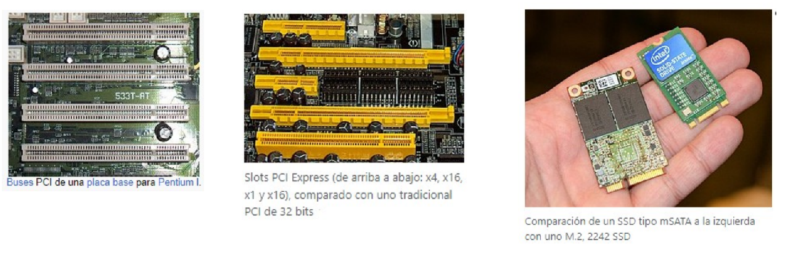

* **RANURAS DE MEMORIA**
  * Estas ranuras constituyen los conectores para la memoria principal del ordenador, la memoria RAM (Random Access Memory). La memoria RAM está formada por varios chips soldados a una placa que recibe el nombre de módulo de memoria. Estos módulos han ido evolucionando en tamaño, capacidad y forma de conectarse a la placa base.
  * Los módulos más comunes son los DIMM. Estas ranuras se
  agrupan en bancos de 1, 2, 4 o 6 zócalos, están numerados y normalmente se colocan abriendo los sujetadores ubicados en cada extremo de la ranura.

    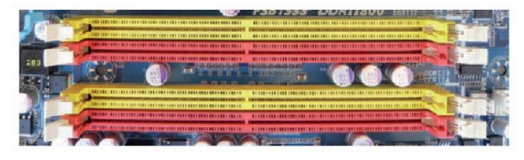

  * Los módulos más comunes son los módulos DIMM de 13,3 cm de largo, y existen: DIMM de 184 pines, para memorias DDR, DIMM de 240 pines, para memorias DDR2 o DDR3, DIMM de 288 pines para memorias DDR4 o DDR5.
  * DDR significa Double Data Rate, y básicamente significa que son capaces de realizar dos tareas de escritura y dos de lectura por cada ciclo de reloj de su controlador.
  * La memoria RAM DDR y DDR2 está ya obsoleta. La RAM
  DDR3 está ya descatalogada, pero todavía son muchos los
  equipos que la utilizan, mientras que la DDR4 está ya afianzada en el mercado desde su lanzamiento en 2014. Las memorias DDR4 han empezado a ser reemplazadas por la RAM DDR5, lanzada a finales de 2021.

  * **MEMORIA RAM → TIPOS DE RAM**

    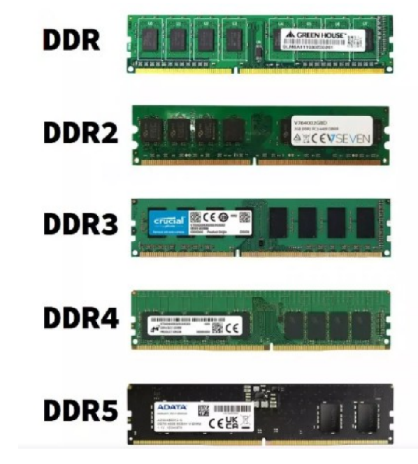

  * Las placas base disponen de tecnología de doble, triple o cuádruple canal (llamado Dual Channel, Triple Channel o Quad Channel).
  * De esta manera se consigue acceder a varios módulos
  simultáneamente, mejorando la velocidad de acceso a la
  memoria RAM por parte del procesador. Ello gracias a duplicar, triplicar o cuadruplicar el canal de 64 bits del single channel por defecto.
  * Las placas base presentan las ranuras de memoria RAM
  asociadas con colores (parejas, tríos o cuartetos) para hacer uso de esta característica.

* **CONECTORES EXTERNOS**

  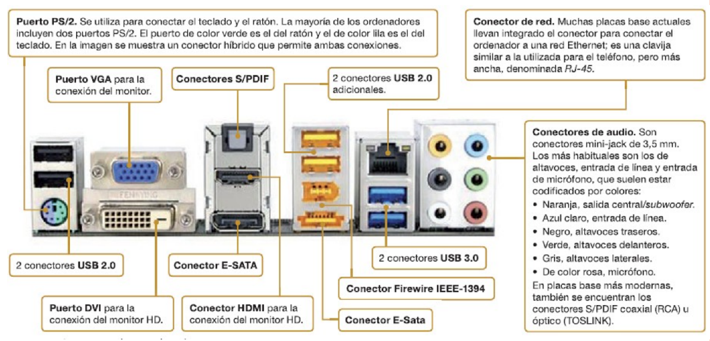

* **VIDEOS MONTAJE ORDENADOR**
  * Cómo montar un ordenador desde cero →
  [https://www.youtube.com/watch?v=TVPtnVD6Qz8](https://www.youtube.com/watch?v=TVPtnVD6Qz8)
  * ¿Qué caja elegir? → [https://www.youtube.com/watch?v=hihHVN_D72s](https://www.youtube.com/watch?v=hihHVN_D72s)
  * Montaje placa base → [https://www.youtube.com/watch?v=gEwCK7LqhYU](https://www.youtube.com/watch?v=gEwCK7LqhYU)
  * Montaje del microprocesador →
  [https://www.youtube.com/watch?v=pzTxM1MjT9c](https://www.youtube.com/watch?v=pzTxM1MjT9c)
  * Instalación memoria RAM →
  [https://www.youtube.com/watch?v=pLx8gq3E_k4](https://www.youtube.com/watch?v=pLx8gq3E_k4)
  * Montaje del disipador/ventilador del procesador →
  [https://www.youtube.com/watch?v=ugsOnBlMGxQ](https://www.youtube.com/watch?v=ugsOnBlMGxQ)
  * Montaje/instalación de la fuente de alimentación →
  [https://www.youtube.com/watch?v=AHNGOgLYJko](https://www.youtube.com/watch?v=AHNGOgLYJko)
  * Cómo conectar los cables del panel frontal →
  [https://www.youtube.com/watch?v=vIR-utT3tcc](https://www.youtube.com/watch?v=vIR-utT3tcc)
  [https://www.youtube.com/watch?v=3Q_kDWI6PzE](https://www.youtube.com/watch?v=3Q_kDWI6PzE)

### Estructura externa de ordenador
* **TIPOS DE CONECTORES**
  * DIN hembra: es de cinco agujeros y corresponde al antiguo conector de teclado estándar. Actualmente no se utiliza
  * PS/2 hembra: es el conector del teclado y el ratón de tipo PS/2. Se llama también mini DIN
  * DE-9 macho: conector de nueve pins. Se llama COM1. Actualmente no suele utilizarse. Era el conector utilizado en los primeros ordenadores para la conexión del ratón.
  * DB-25 macho: conector de veinticinco pins. Puede ser también de nueve pins. Se llama COM2 y actualmente
  no se encuentra prácticamente en ningún ordenador, se utilizaba para la impresora.
  * DB-25 hembra: conector de veinticinco agujeros. Es el conector en paralelo LPT1. Se utilizaba para la conexión de impresoras.
  * DB-15 HD (alta densidad) hembra: salida de vídeo de quince hoyos distribuidos en tres hileras. Es el conector de salida de la tarjeta gráfica VGA y SVGA. Conexión D-Sub.
  * USB: es el conector del bus en serie universal
    * USB tipoA, USB tipo B, USB tipo C, Mini USB, Micro USB
  * RJ11: es el conector de módem para conectar la línea telefónica
  * RJ45: es el conector de red.
  * HDMI: Interfaz de video y audio para transferir datos
  * DVI-I: DVI son las siglas de Digital Visual Interface y ofrece una imagen más nítida y mejor que VGA. Suele utilizarse para conectar ordenadores y otros dispositivos a dispositivos de salida como monitores y proyectores
  * Thunderbolt: se usa para cargar dispositivos, transferir datos y conectar ordenadores a periféricos como monitores.
  * Conectores Jack: conector de audio analógico, no digital.
  * Conector RCA: tipo de conector eléctrico comúnmente utilizado para transportar señales de audio y video. Conectores RCA para video compuesto (cable amarillo) y sonido estereofónico (blanco y rojo).
  * Conector Firewire: tipo de conexión para conectar en tiempo real diferentes tipos de dispositivo digital, desde ordenadores hasta discos duros o cámaras digitales
  * Displayport: interfaz para conexión de video y opcionalmente audio. Sirve para conectar un PC a un monitor.

    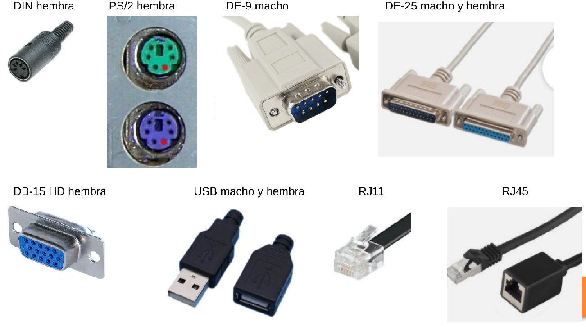

    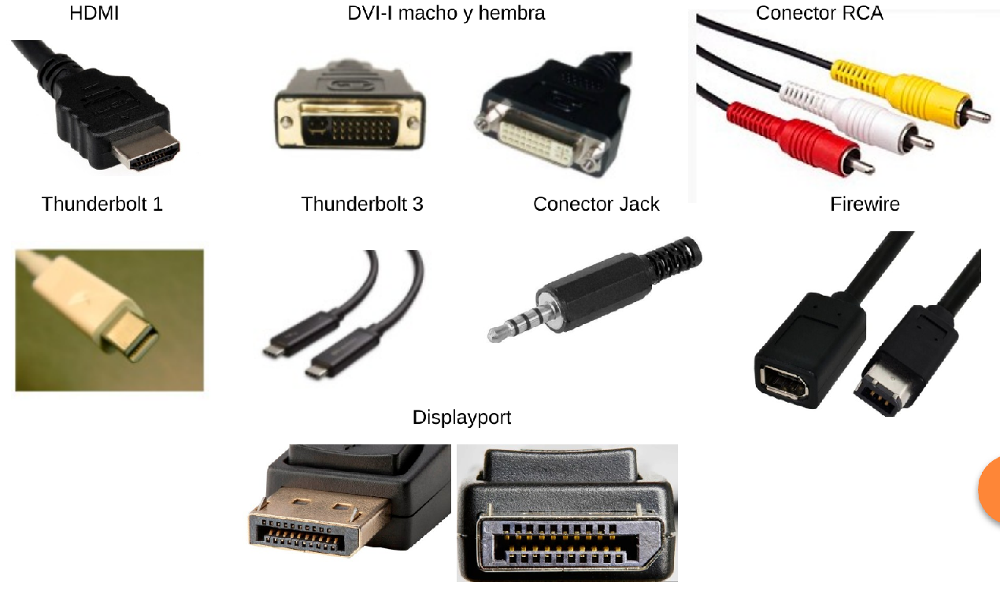

    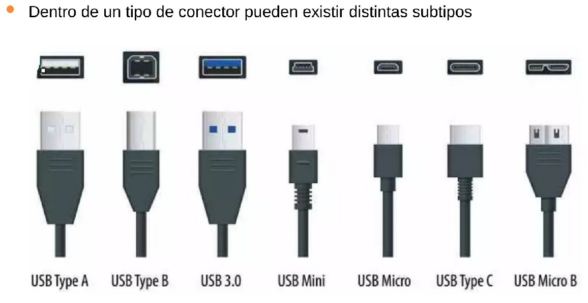

    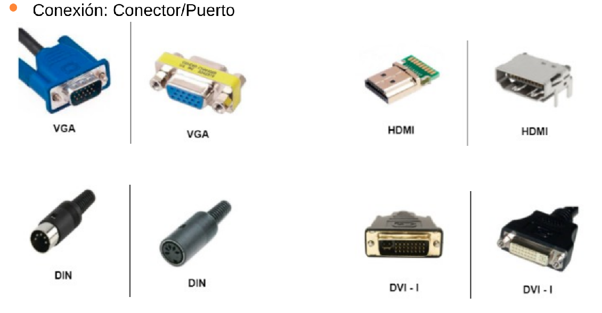

* **DISPOSITIVOS DE ALMACENAMIENTO**

    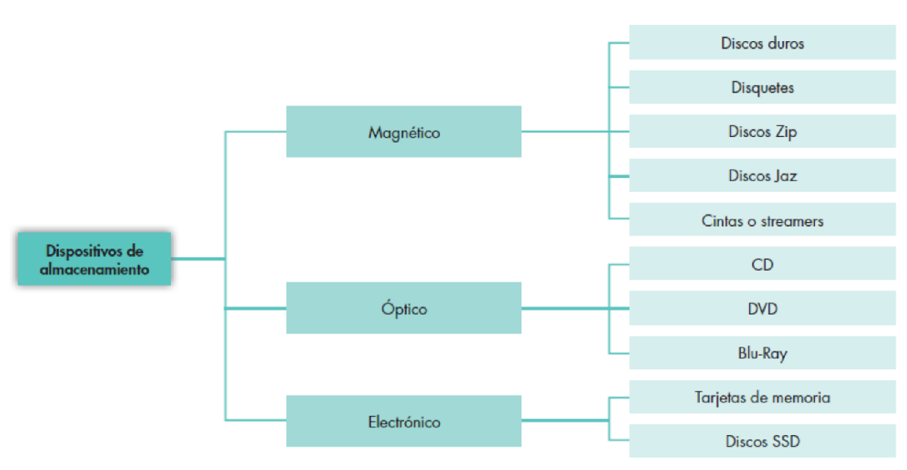

  * Discos Duros -> Estructura Física

    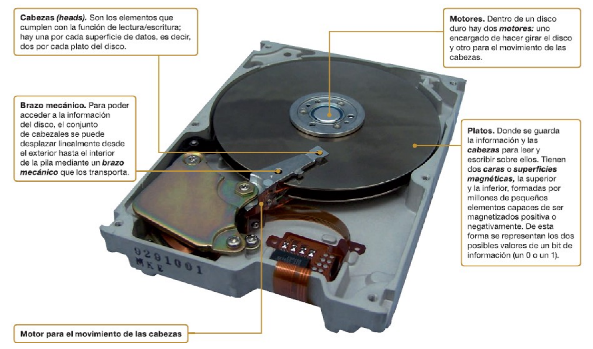

    Disco duro por dentro →
    [https://www.youtube.com/watch?v=S067wQRIgF0](https://www.youtube.com/watch?v=S067wQRIgF0)

* **DISCOS DUROS SSD**
  * Los discos duros SSD (Solid-State Drive) están basados en memorias no volátiles (como las memorias flash) o volátiles como la SDRAM, en lugar de estar basados en tecnologías móviles como los discos de platos tradicionales.
  * Al no tener elementos móviles, son mucho más rápidos y silenciosos, no desprenden calor, resisten mucho mejor los golpes y su consumo energético es inferior.
  * Los SSDs basados en memoria flash no volátil son los que se utilizan masivamente por sus ventajas de coste, tamaño y no volatilidad, con la memoria flash NAND como tecnología predominante.
  
  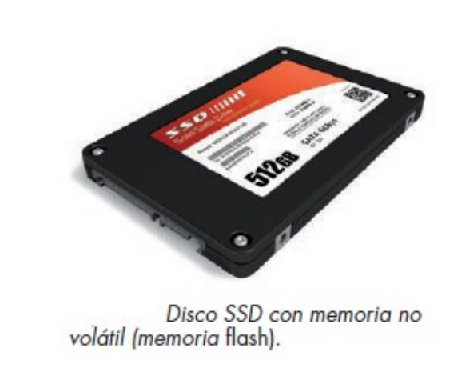

  * SSD de Memoria Flash (NAND): Son la opción principal y más común en el mercado.
    * Utilizan memoria no volátil (como la flash NAND) que no necesita batería y conserva los datos incluso sin energía, similar a una memoria USB.
    * Tienen un coste y tamaño más bajos en relación a su capacidad, lo que favorece su adopción.
    * No tienen partes móviles, lo que los hace más resistentes a golpes y caídas.
  * SSD de Memoria Volátil (DRAM):
    * Son más rápidos que los de memoria flash, pero requieren una batería para mantener los datos.
    * Su necesidad de batería y mayor coste los hace una opción menos común y más específica, no la principal.
    * Originalmente se diseñaban con este tipo de memoria.

* **DISPOSITIVOS DE ALMACENAMIENTO ÓPTICO**
  * El CD apareció por primera vez en 1982 en formato de audio. Los CD-ROM aparecieron en 1984; eran muy caros, por lo que hubo de pasar un tiempo para que reemplazaran a los disquetes como medio de distribución de software. Estos permitían almacenar hasta 700 MB.
  * El software siguió en aumento y numerosos productos de software necesitaban varios CD-ROM. Surgió entonces el DVD, que permite almacenar hasta 17 GB. Más tarde, apareció el formato Blu-Ray con la capacidad de almacenar hasta 128 GB.
  * Los CD-ROM y DVD son dispositivos de almacenamiento óptico. Al igual que en los discos, el almacenamiento es digital; la unidad lee una secuencia de unos y ceros y los convierte al formato del ordenador.
  * CDs: Así se hacen y así funcionan
    * [https://www.youtube.com/watch?v=KOkIcK0XcTg](https://www.youtube.com/watch?v=KOkIcK0XcTg)

    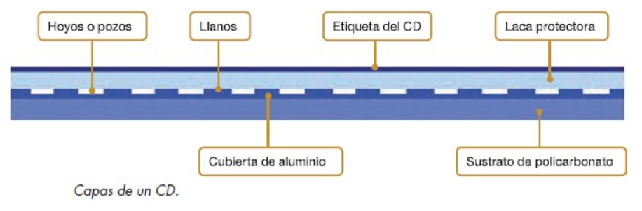

* **DISPOSITIVOS DE ALMACENAMIENTO → TARJETAS DE MEMORIA FLASH**
  * Son unos dispositivos portátiles de pequeño tamaño, con gran capacidad de almacenamiento, bastante resistentes a golpes y de bajo consumo. Las utilizan numerosos dispositivos, como teléfonos móviles, PDA, reproductores de audio o cámaras digitales.
  * La memoria flash es un tipo de memoria EEPROM, y es
  una memoria no volátil; es decir, conserva los datos
  cuando se apaga el dispositivo que la alimenta. La velocidad de transferencia de datos dependerá del chip de memoria, del controlador y de la interfaz.

* **DISPOSITIVOS DE ALMACENAMIENTO → LECTORES DE TARJETAS**
 
  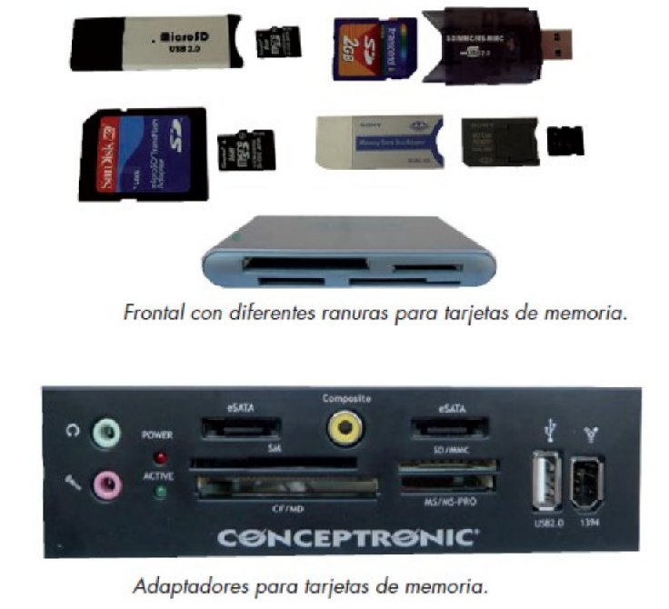

* **PERIFÉRICOS**
  * Los dispositivos periféricos son los encargados de
  establecer la comunicación entre el ordenador y el exterior.
  * Los periféricos permiten:
    * la entrada de información para realizar los procesos que se requieran,
    * la comunicación interactiva con el usuario durante los procesos y la salida de información con los resultados obtenidos tras los procesos realizados.
  * Los periféricos se pueden clasificar en los siguientes tipos:
    * Periféricos de Entrada
    * Periféricos de Salida
    * Periféricos de Entrada/Salida

  * Periféricos de entrada: mediante ellos introducimos
  datos desde el exterior al ordenador.
    * Ejemplos de ellos son: el teclado, el ratón, el escáner, el lápiz óptico, el lector de código de barras, el lector de tarjeta magnética, etc.

      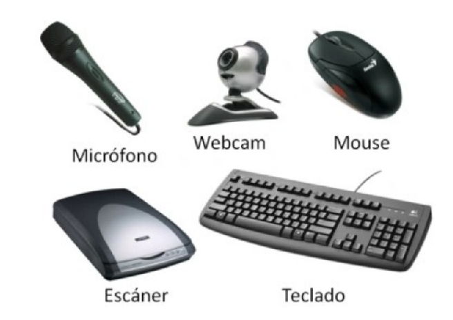

    * Periféricos de salida: mediante ellos podemos ver los resultados de un proceso. Trasmiten los resultados obtenidos tras el procesamiento de la información al exterior del sistema informático para que pueda ser utilizado por los seres humanos u otros sistemas diferentes.
      * Ejemplos son: el plotter, la impresora, el fax y la pantalla.

      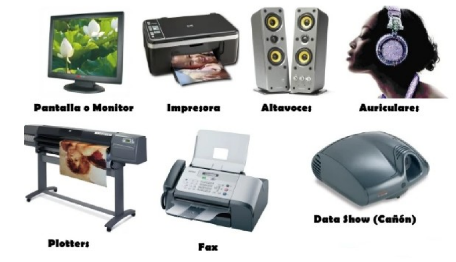

    * Periféricos de entrada/salida: estos periféricos se
    utilizan para suministrar información tanto al equipo
    como a las personas que los emplean.
    * De comunicaciones: permiten la comunicación con otroso rdenadores a través de diversos medios, como puede ser: el cable de red o de la línea telefónica. Periféricos de este tipo son las tarjetas de red, los módems o los routers.

      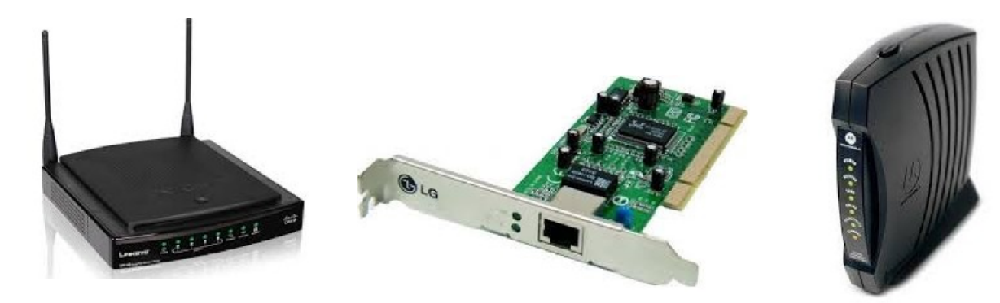

    * Periféricos de entrada/salida: estos periféricos se utilizan para suministrar información tanto al equipo como a las personas que los emplean.
      * De información o de almacenamiento: permiten al ordenador almacenar temporal o indefinidamente la información o los programas en los soportes de información como por ejemplo: el disco duro, el CD, el DVD o el pendrive.

        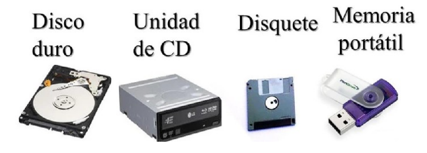

    * En la actualidad podemos encontrar periféricos que aunque inicialmente eran sólo de entrada o de salida, hoy en día sirven tanto para entrada como para salida de datos, por ejemplo la impresora multifunción que integra impresora y escáner; los auriculares con micrófono incorporado o la pantalla táctil que nos permite interactuar por medio del tacto.
  
      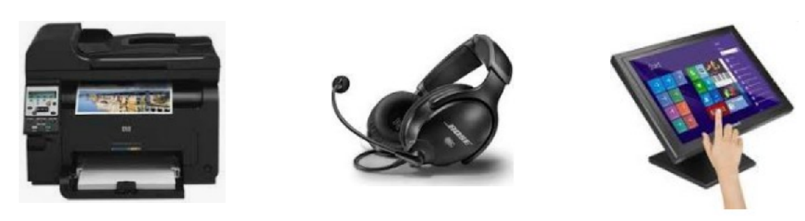

    * ***ACTIVIDAD***
    Indicar todas las opciones posibles que encontréis para poder conocer que placa base tenemos en nuestro ordenador, tanto desde Windows como desde Linux.
    Buscar que placa base tenemos en nuestro ordenador y buscar el manual, bajárselo si es posible e indicar donde se encuentra la información referente a donde se conectan los cables de encendido, reset, leds, etc. de la caja.

      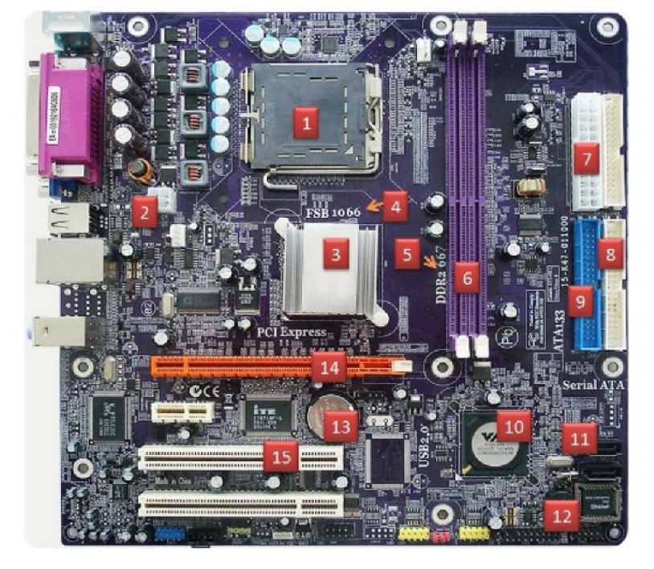

    * ***Solución***
      

      La solución al ejercicio se puede revisar en esta dirección web: 
      [https://www.picuino.com/es/informatica-hardware-placabase.html](https://www.picuino.com/es/informatica-hardware-placabase.html)
      

<h2 id="software"><u>SOFTWARE</u></h2>

  * **Software base o de sistema**
    * Se define como el software básico sin la cual el ordenador no puede funcionar. El sistema operativo es el alma del ordenador.
    Sirve de comunicación entre el usuario y el hardware de la máquina. Controla los recursos hardware de la máquina según las necesidades, los programas de aplicación, el lugar donde se almacenan los datos, el momento en que hay que imprimir, el momento en que se pulsa un botón del ratón, etc.
  * **Software de aplicaciones**
    * Es la parte del software que sirve para procesar la información de forma personalizada. Lo integran los programas y los datos. Los programas permiten editar textos, extraer información, editar gráficos, realizar cálculos numéricos, etc.
    * El software de aplicaciones no se puede ejecutar sin un software de base como es el sistema Operativo.
  * **Software de programación**
    * Conjunto de software necesario para el diseño, desarrollo o implementación de software de sistema o de aplicación. En este se incluyen editores, compiladores, depuradores de código y entornos de desarrollo integrados (IDE)
  
## **SISTEMA OPERATIVO**
  * El sistema operativo se encarga de gestionar eficazmente los recursos hardware y software del sistema de forma transparente para el usuario, actuando de interfaz entre el hardware y el usuario.

    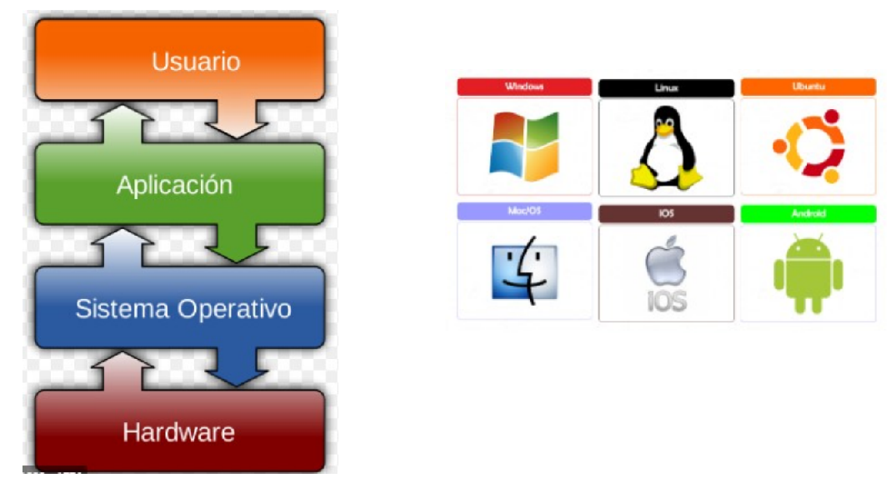

  * Funciones:
    * Asignación de recursos
    * Gestión de ficheros
    * Protección de la información
    * Planificación, carga y supervisión de la ejecución de programas o tareas
    * Coordinación de las comunicaciones entre el ordenador y los periféricos
    * Tratamiento de errores
    * Inicialización del sistema o arranque

<h2 id="dispositivos"><u>Controladores de dispositivos</u></h2>

  * Los dispositivos hardware del sistema informático necesitan ser reconocidos por el SO, para ello los componentes hardware disponen de controladores que se encargan de gestionar y coordinar el funcionamiento del dispositivo, además de establecer un “diálogo” con la estructura de orden superior del sistema informático.
  * Proporciona una interfaz de software con el hardware, lo que permite a los sistemas operativos y otros programas informáticos acceder a las funciones del hardware sin necesidad de conocer detalles precisos sobre el hardware que se está utilizando.
  * Los sistemas operativos disponen de una gran variedad de drivers preinstalados que no hace falta su instalación en el momento de la conexión. No obstante, es recomendable su instalación, especialmente cuando no es muy común o dispone de características especiales.
  * La instalación puede ser ex profeso o a través del administrador de dispositivos que provea el sistema operativo.

  * *Administración de dispositivos*
    * SO Windows: El Administrador de dispositivos indica dispositivos que no se encuentren bien configurados o sin drivers mediante un icono de advertencia. En tal caso, hemos de instalar o actualizar su driver.

      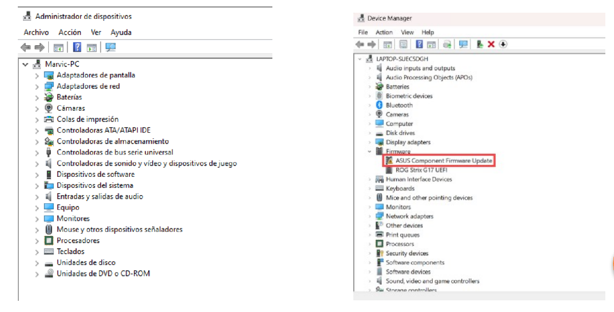

    * SO Ubuntu: Aunque los sistemas Linux suelen reconocer la mayoría de los dispositivos, podemos acceder a la administración de éstos mediante la orden lshw. Existen otras aplicaciones que muestran gráficamente los detalles de los dispositivos, por ejemplo hardinfo.

      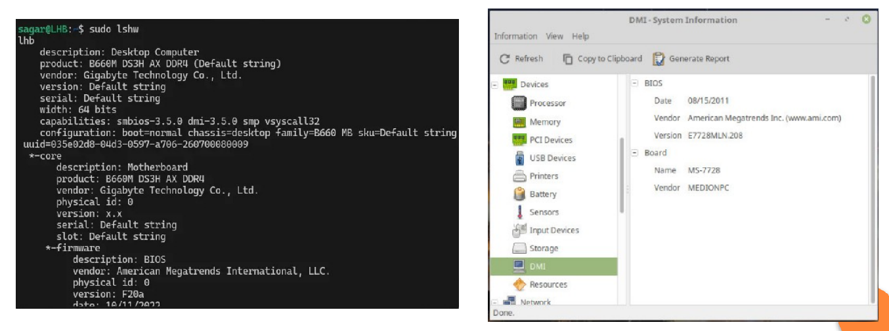

<h2 id="post"><u>Proceso de arranque de un sistema informático. POST</u></h2>

  *  Al pulsar el botón de arranque, la fuente de alimentación distribuye los siguientes voltajes:
     * 3,3 V para los componentes electrónicos de más baja potencia (ej: memoria RAM o unidades SSD de formato M.2)
     * 5 V para otros componentes de poca potencia (ej: HDD, unidades ópticas o puertos USB)
     * 12 V para dispositivos que emplean motores o que necesiten transformarse en valores menores (tarjeta gráfica, ventiladores o algunas tarjetas de expansión PCIe)
  * El procesador comienza a ejecutar las instrucciones de la BIOS (estas se almacenan previamente en la memoria principal).
  * Una de las primeras tareas de la BIOS es el testeo del sistema: POST (Power On Self Test). Durante el proceso se testean componentes como los siguientes para detectar si existe algún problema o error:
    * Procesador
    * Memoria
    * Fuente de alimentación
    * Placa base
  * Si se encuentra algún error, la BIOS efectúa señales indicando el tipo de error y en función de la gravedad, continuar o no con el arranque del sistema.
  * Proceso de arranque de un sistema informático. POST
  * Estas señales pueden ser:
    * Sonoras: a través del altavoz de la placa base mediante pitidos.
    * Visuales: algunas placas base incorporan displays que indican el error con un código. También se pueden emplear tarjetas POST, conectadas a ranuras de expansión para mostrar el error.

      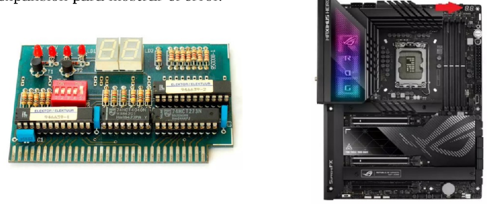

  * Estas señales no son universales, según el fabricante y modelo de la BIOS los avisos sonoros o por códigos visuales tienen una correspondencia con el error detectado que se debe consultar en la guía del fabricante de la BIOS.
  * Pitidos de la BIOS → [https://www.youtube.com/watch?v=qGIi7HhoYAk](https://www.youtube.com/watch?v=qGIi7HhoYAk)
  
  * **Códigos de pitido POST (fabricante AWARD)**
    
      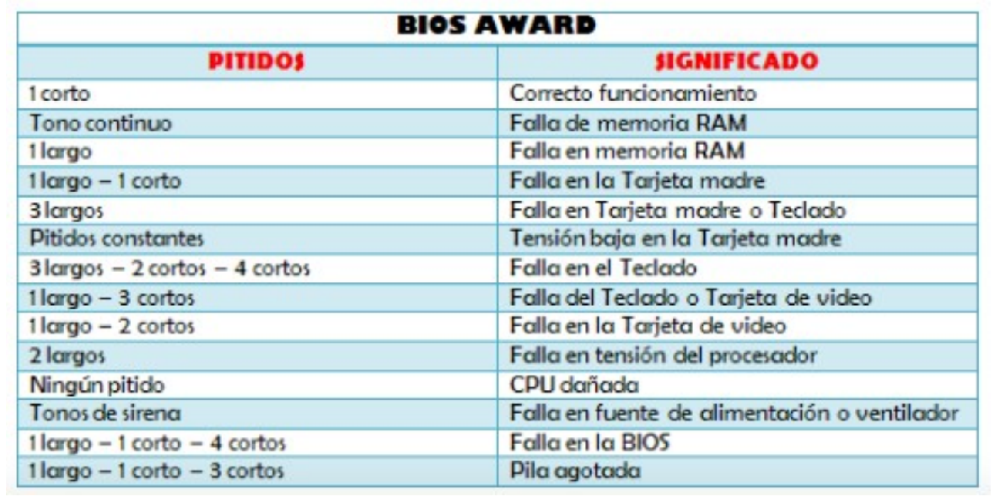

    * A continuación del testeo la BIOS configura e inicializa los componentes hardware, atendiendo a los valores de la RAM-CMOS de la BIOS, los cuales se pueden configurar accediendo al BIOS Setup Utility.

    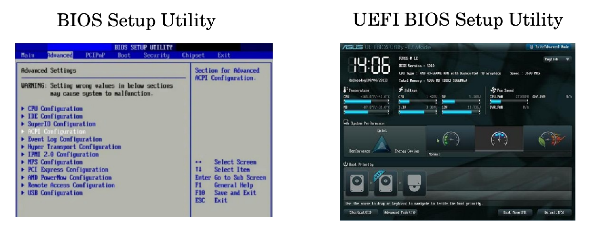

    * La BIOS configura e inicializa los componentes hardware, atendiendo a los valores de la RAM-CMOS de la BIOS:
      * 1. Se inicia el adaptador gráfico
      * 2. Testea, inicializa y establece algunos valores del adaptador gráfico, procesador, memora RAM, dispositivos de almacenamiento secundario, etc.
      * 3. Muestra mensajes para acceder al BIOS Setup Utility
      * 4. Se activan los buses de la placa base
      * 5. Se activan otros dispositivos Plug and Play
      * 6. Se activan otras BIOS de componentes
      instalados en la placa base
      * 7. Se muestra un resumen de los dispositivos
      detectados y recursos asignados

      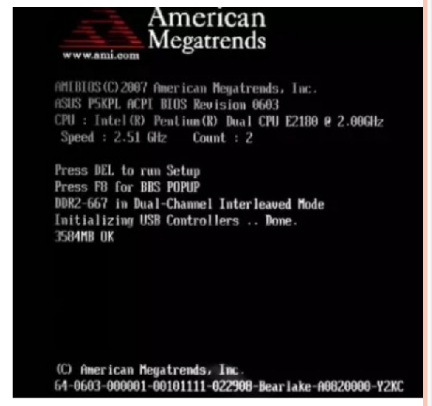

    * Una vez terminado todo el proceso POST, inicialización y configuración de componentes, la BIOS le pasa el testigo al primer medio de almacenamiento (configurado en la BIOS Setup Utility) para que comience la carga del sistema operativo.
    * En esta segunda etapa, si se detecta algún problema en alguno de los pasos de inicialización, configuración o paso de testigo al primer medio de arranque, se mostrará el correspondiente mensaje por pantalla. Por ejemplo:
  
      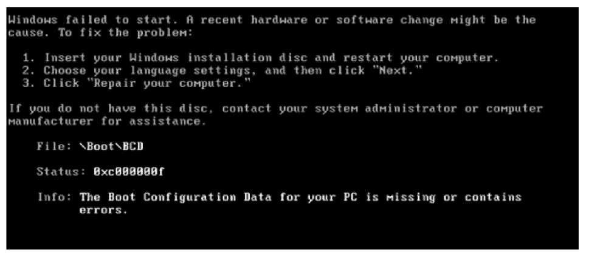

<h2 id="maquina-virtual"><u>MÁQUINAS VIRTUALES</u></h2>

  * Llamamos máquina virtual a una computadora no real, instalada y configurada en un sistema informático mediante un software que permite simular su funcionamiento autónomo.
  * Cuando se habla de virtualización en informática, estamos hablando de la abstracción de los recursos hardware de la computadora. El sistema informático al que se abstraen sus recursos para poder instalar la máquina virtual se denomina host o anfitrión. Sobre estos se podrá instalar la máquina virtual con sistemas operativos guest o invitado.
  * Las máquinas virtuales se emplean principalmente para:
    * Realizar pruebas
    * Portabilidad
    * Ahorro de costes
    * Centralización de servicios
  * Para llevar a cabo la virtualización se necesita de un software de abstracción de los recursos hardware de una máquina anfitriona, llamado hipervisor o VMM (virtual machine monitor).
  * El software de virtualización permite crear varias máquinas virtuales con diferentes recursos hardware y hacer uso de ellas simultáneamente. Además, el software de virtualización debe gestionar los recursos hardware del equipo anfitrión entre el conjunto de máquinas virtuales creadas sobre él.

  * ***Tecnologías:***
    * Atendiendo a donde se alojan se distinguen dos categorías:
      * De tipo 1 (nativos): se instalan sobre el hardware y se ejecutan directamente en el servidor, gestionando los sistemas operativos invitados.
        * Proxmox, VMWare ESXi y Hyper-V
      * De tipo 2 (alojados): se instalan sobre el sistema operativo como una capa software.
        * Oracle VM VirtualBox, VMWare Workstation, QEMU

    * ***Características:***
      * Algunas de las características y funciones más importantes que presentan las plataformas de virtualización y que determinan su elección son:
        * Plataforma. Variedad de SOs y arquitecturas (32 o 64 bits) sobre los que se pueda instalar.
        * SOs guest. Qué SO se puede instalar en el host
        * Licencia. Tipo de licencia
        * Portabilidad. Posibilidades para exportar una máquina virtual
        * Compatibilidad entre máquinas virtuales de distinto software de virtualización.
        * Creación y gestión de instantáneas o puntos de restauración
        * Actualización del software y soporte técnico

      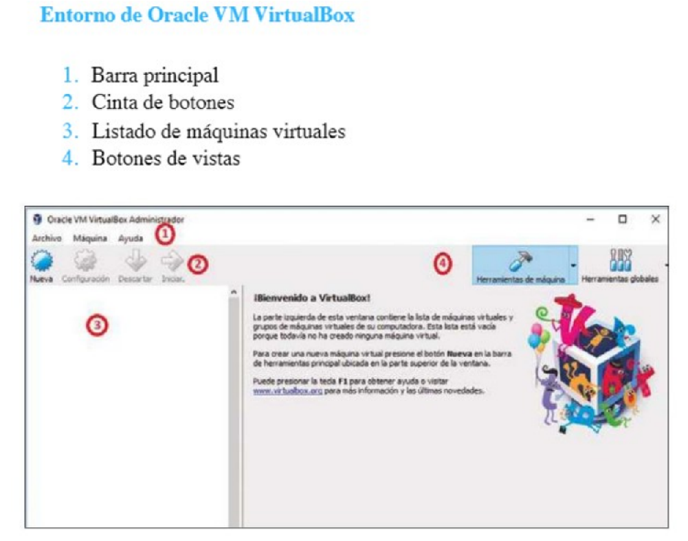

  * Opciones al crear una máquina virtual (MV) en VirtualBox:
    * Nombre y sistema operativo: Nombre con el se crea la MV, se debe intentar poner nombres cortos representativos del contenido de la MV. Además de elegir el tipo de sistema operativo que se va a instalar.
    * Tamaño de memoria: Seleccionar la cantidad de memoria RAM que queremos disponer en la máquina virtual. Esta cantidad de memoria reservada se retirará del sistema operativo anfitrión durante la ejecución de la máquina virtual, por lo que hemos de ser conscientes de esa limitación.
    * Disco duro: Selección del tamaño y medio de almacenamiento virtual para la MV:
      * No agregar un disco virtual
      * Crear un disco virtual ahora
      * Usar un disco virtual existente
      
      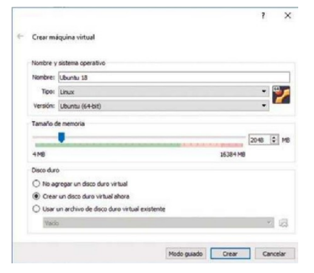

  * Creación de instantáneas (snapshots)
    * Una instantánea es el estado de configuración de una máquina virtual en un momento dado, es decir, una forma de almacenar todas sus propiedades. De esta manera, se pueden crear múltiples instantáneas para recuperarlas posteriormente. Su principal utilidad es la de copia de seguridad ante situaciones cambiantes de software o hardware, pruebas, etc.
    * Es recomendable por ejemplo realizar una instantánea como backup del sistema al instalar el sistema operativo o ante la instalación de software importante que se crea conveniente conservar en un instante dado.

      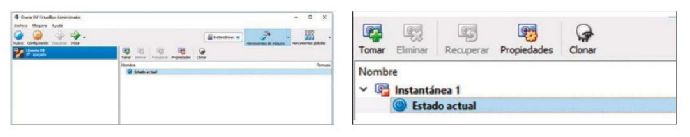

  * EJEMPLOS:
    * INSTALAR Ubuntu 22.04 en VirtualBox: [https://www.youtube.com/watch?v=hLfVO0GwheU](https://www.youtube.com/watch?v=hLfVO0GwheU)
    * INSTALAR Ubuntu 24.04 en VirtualBox: [https://www.youtube.com/watch?v=qH9JuCjCKow](https://www.youtube.com/watch?v=qH9JuCjCKow)
    * INSTALAR Windows 11 en VirtualBox: [https://www.youtube.com/watch?v=mcjQ_aQQjk4](https://www.youtube.com/watch?v=mcjQ_aQQjk4)
    * INSTALAR Windows 10 en VirtualBox: [https://www.youtube.com/watch?v=gfM9uMT575w&list=PLG1hKOHdoXkvF6Q5VcGZrRSeE7Eu38s3J](https://www.youtube.com/watch?v=gfM9uMT575w&list=PLG1hKOHdoXkvF6Q5VcGZrRSeE7Eu38s3J)

  * Actividad
    1. Crea una máquina virtual con el nombre Prueba, estableciendo una configuración con memoria RAM de 2 GB y un disco duro de tamaño fijo de 20 GB. Crearemos una instantánea y, a continuación, elimina la máquina virtual.

<h2 id="seguridad"><u>ANORMAS DE SEGURIDAD Y PREVENCIÓN DE RIESGOS LABORALES</u></h2>

  * Cuando trabajamos con un sistema informático, debemos adoptar unas recomendaciones ergonómicas y de seguridad básicas de cara a prevenir o minimizar cualquier riesgo laboral.
  * En la Unión Europea y en España existe una normativa específica en cada sector laboral que regula las normas de seguridad y de prevención de riesgos laborales.
  * En España, la norma más amplia al respecto es la Ley 31/1995 de prevención de riesgos laborales que establece la seguridad para el trabajador cuando realiza sus actividades laborales. Esta ley señala que “los trabajadores tienen derecho a una protección eficaz en materia de seguridad y salud en el trabajo”.
  * Para prevenir los riesgos laborales se debe:
    * Adoptar un plan de prevención de riesgos laborales.
    * Evaluar los riesgos.
    * Planificar y ejecutar la actividad preventiva.
  * Obligaciones del trabajador
    * Usar adecuadamente las máquinas, aparatos, herramientas, etc. y otros medios con los que desarrollen su actividad.
    * Utilizar correctamente los medios y equipos de protección facilitados por el empresario de acuerdo con las instrucciones recibidas.
    * No poner fuera de funcionamiento y utilizar correctamente los dispositivos de seguridad existentes.
    * Contribuir al cumplimiento de las obligaciones establecidas por la autoridad competente.
    * Cooperar con el empresario para que este pueda garantizar unas condiciones de trabajo que sean seguras y no entrañen riesgos para la seguridad y la salud de los trabajadores.

  * ***Ergonomía***
    * La ergonomía es una técnica no médica y multidisciplinar que tiene por objeto adaptar el entorno de las personas a sus características y exigencias anatómicas, fisiológicas y psicológicas.
    * Desde el punto de vista económico, la ergonomía aporta, a la empresa, salud para el trabajador y, en consecuencia, más productividad y menos absentismo por accidentes o enfermedades profesionales.
    * La ergonomía diseña los puestos de trabajo, máquinas y herramientas buscando siempre la máxima seguridad, eficacia y confort para el usuario; también investiga nuevas formas de organización del trabajo o las características que debe reunir el ambiente físico para a ser saludable para los trabajadores.
    * La ergonomía busca definir condiciones materiales de trabajo seguras, saludables y confortables para el trabajador, y útiles para el empresario para una mejora de la calidad y cantidad del trabajo realizado.
  
  * Las normas de seguridad y prevención de riesgos laborales respecto a los equipos con pantallas de visualización tienen en cuenta los siguientes puntos:
    * Pantalla
    * Teclado
    * Mesa o superficie de trabajo
    * Asiento del trabajo
    * Entorno
  * Ergonomía en la Oficina: Pantallas de visualización de datos - [https://www.youtube.com/watch?v=e-3_rKmsjmQ](https://www.youtube.com/watch?v=e-3_rKmsjmQ)
  * Recomendaciones para el uso saludable del ordenador - [https://www.youtube.com/watch?v=dYO1CAfDfog](https://www.youtube.com/watch?v=dYO1CAfDfog)

    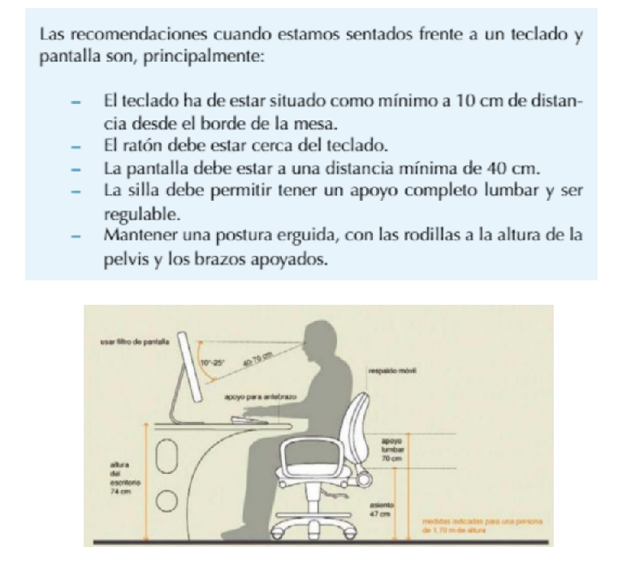

