# SISTEMAS OPERATIVOS. INTRODUCCIÓN.

---

## Índice de Contenidos

* [Funciones y características](#funciones-basicas)
* [Definición y Funciones Básicas de un SO](#sistema-operativo)
* [Características de un Sistema Operativo](#carac-so)
* [Módulos de Administración del Sistema](#mod-admin)
* [Procesos, Flujos, Hilos y Bloque de Control de Procesos (BCP](#procesos-bcp)
* [Algoritmos de Planificación](#algoritmo-pla)
* [Otros Módulos de Administración del SO](#otro-admin)
* [Clasificación de Sistemas Operativos](#clas-so)
* [Arquitecturas de Sistemas Operativos](#arqui-so)
* [Versiones y Distribuciones Principales](#ver-dis)
* [Instalación, Particionamiento y Arranque](#inst-part)
* [Organización del espacio de almacenamiento](#org-almacen)
* [Mantenimiento y Gestión de Paquetes](#mant-gest)

---
<h2 id="funciones-basicas"><u>1. Mapa Conceptual del Tema</u></h2>

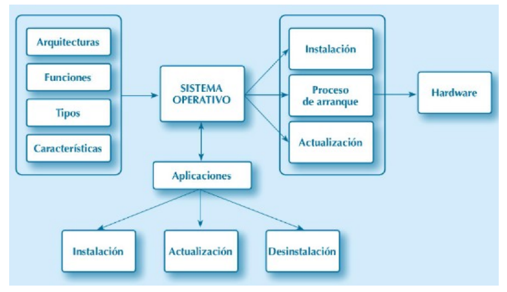

* **Sistema Operativo:**
  * **Aspectos teóricos y conceptuales:** Arquitecturas, Funciones, Tipos, Características.
  * **Gestión sobre la máquina y ciclo de vida:** Instalación, Proceso de arranque, Actualización.
  * **Interacción:** Hardware $\leftarrow$ Sistema Operativo $\leftrightarrow$ Aplicaciones.
* **Aplicaciones:**
  * Instalación
  * Actualización
  * Desinstalación

---

<h2 id="sistema-operativo"><u>2. Definición y Funciones Básicas de un SO</u></h2>

### Sistema Informático: Software
* **Software base o de sistema:** Se define como el software básico sin el cual el ordenador no puede funcionar.
* El sistema operativo es el alma del ordenador. Sirve de comunicación entre el usuario y el hardware de la máquina.
* Controla los recursos hardware de la máquina según las necesidades, los programas de aplicación, el lugar donde se almacenan los datos, el momento en que hay que imprimir, el momento en que se pulsa un botón del ratón, etc.
* Sistemas operativos representativos:* Windows, Linux, Ubuntu, macOS, iOS, Android.

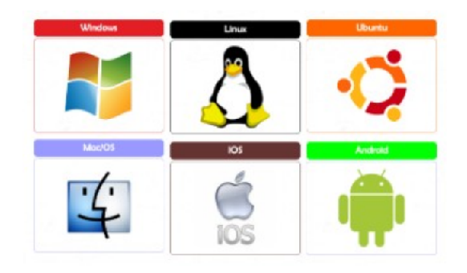

#### Relación por capas del sistema
$$\text{Usuario} \longleftrightarrow \text{Aplicación} \longleftrightarrow \text{Sistema Operativo} \longleftrightarrow \text{Hardware}$$

### Funciones Básicas
* Actuar de interfaz entre el usuario y el hardware de manera transparente para el primero.
* Gestionar los recursos software y hardware del equipo.

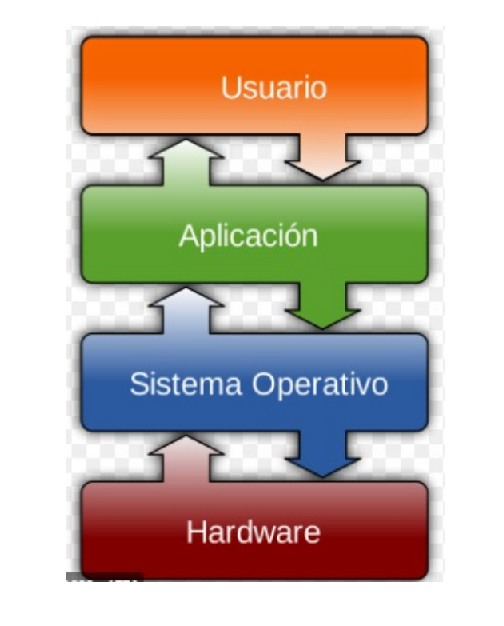

---

<h2 id="carac-so"><u>3. Características de un Sistema Operativo</u></h2>

* **Adaptabilidad:** Se debe acomodar a evoluciones software o hardware (mediante actualizaciones).
* **Facilidad de uso:** Teniendo en cuenta el fin al que se empleará el sistema informático, la facilidad de manejo ha de ser primordial.
* **Eficiencia:** Debe repartir recursos limitados entre usuarios, software y sistema operativo. Además, hay que tener en cuenta que el SO es software y, por tanto, también consume recursos (y no son pocos).

  ***Recursos que el SO debe administrar eficientemente:***
  * **Memoria RAM:** Hay una parte del sistema operativo que siempre reside en memoria, denominada **núcleo o kernel**. Es un subconjunto del propio SO que por su importancia no puede abandonar la memoria principal. El resto de memoria RAM se debe gestionar eficientemente para albergar el resto del software y los datos que se manejen.
  * **Procesador:** Si dispone de varios núcleos, repartir estos entre la multitud de procesos que se han de ejecutar.
  * **Adaptadores de Red:** Muchas aplicaciones hacen uso de la red simultáneamente, por lo que se deben administrar las conexiones de red entre aplicaciones, procesos y usuarios.
  * **Medios de almacenamiento:** El acceso a discos duros puede representar un cuello de botella importante.
  * **Colas de impresión:** Puede existir más de una petición de impresión a una misma impresora; se debe gestionar la cola de trabajos de impresión.

* **Evolución de los Sistemas Operativos:** [https://www.youtube.com/watch?v=E2fAqDFz9SY](https://www.youtube.com/watch?v=E2fAqDFz9SY)

---

<h2 id="mod-admin"><u>4. Módulos de Administración del Sistema</u></h2>

La administración del sistema por parte del SO se divide en:
1. **Gestión de procesos**
2. **Gestión de memoria**
3. **Gestión de entradas y salidas**
4. **Gestión de almacenamiento secundario**
5. **Gestión de la seguridad**
6. **Gestión de los errores**
7. **Gestión de la interfaz de usuario**

---

### 4.1 Gestión de Procesos

El SO debe gestionar el reparto de tiempo del procesador entre los diferentes procesos de tal manera que los tiempos de ejecución de las diferentes tareas sigan los objetivos del SO:
* La asignación de procesos a varios procesadores (si dispone de varios).
* El uso de la multiprogramación sobre procesadores individuales y sus núcleos.
* La ejecución de una aplicación o proceso en cuanto a su sincronización con otros procesos o hilos.

#### Políticas de Planificación
* **Planificación orientada a los usuarios (orientada a E/S):**
  * Centrada en maximizar la interactividad del usuario y la eficiencia en operaciones de entrada/salida ($E/S$).
  * Agiliza accesos a discos, pantallas táctiles o accesos a Internet. Prima el tiempo de respuesta.
* **Planificación orientada al sistema (orientada a CPU / cálculo):**
  * Enfocada en optimizar el uso de la CPU para procesos con cálculos intensivos y pocas operaciones de $E/S$.
  * Ideal para aplicaciones científicas o procesamiento masivo de datos.

* La planificación orientada a los usuarios es más adecuada para sistemas interactivos donde el tiempo de respuesta es crítico, mientras que la planificación orientada al sistema está diseñada para maximizar la eficiencia de la CPU en sistemas de cálculo intensivo. La elección del enfoque depende del tipo de carga de trabajo que maneje el sistema.

  #### Comparativa de Planificación
  | Característica | Planificación Orientada a Usuarios ($E/S$) | Planificación Orientada al Sistema (CPU) |
  | :--- | :--- | :--- |
  | **Tipo de procesos priorizados** | Operaciones de entrada/salida | Cálculos intensivos |
  | **Objetivo principal** | Minimizar el tiempo de respuesta de los usuarios | Maximizar la utilización de la CPU |
  | **Interactividad** | Alta, adecuada para aplicaciones interactivas | Baja, adecuada para procesos de cálculo intensivo |
  | **Cambios de contexto** | Frecuentes debido a la espera por $E/S$ | Menos frecuentes, periodos largos de ejecución |
  | **Algoritmos típicos** | Round Robin, SRTF | FCFS, SJF, Prioridad |

---

<h2 id="procesos-bcp"><u>5. Procesos, Flujos, Hilos y Bloque de Control de Procesos (BCP)</u></h2>

* **Un proceso** es un concepto manejado por el sistema operativo y que referencia un programa en ejecución. A los procesos,  dependiendo especialmente del sistema operativo utilizado, se les denomina flujos de control, tareas, threads o hilos, según el contexto. 
* Cuando se ejecuta más de un proceso de forma concurrente en un sistema, todos necesitan que el propio sistema les suministre una serie de recursos. Para ello, el sistema operativo, gracias a la CPU,
se encarga de asignar estos recursos en un orden adecuado y atendiendo a unas prioridades. También realiza funciones de sincronización de todos los procesos, para que se ejecuten en el orden adecuado y según la prioridad decidida.
* Cada vez que un programa se convierte en proceso, es decir, cada vez que se ejecuta un programa, además de ubicar en memoria las instrucciones que lo componen y sus datos asociados, a dicho proceso se le asocia una estructura de datos.
* Esta estructura de datos, que es única para cada proceso, identifica el proceso respecto de los demás y sirve para controlar su correcta ejecución. Es lo que se llama el bloque de control del proceso o BCP, y contendrá para cada proceso la siguiente información: estado actual del proceso, identificador del proceso, prioridad del proceso, ubicación en memoria y recursos utilizados.

* **Bloque de Control del Proceso (BCP / PCB):** 
  * Toda la información de un proceso que el sistema operativo necesita para controlarlo se mantiene en una estructura de datos: el bloque de control de procesos o BCP. En sistemas operativos multiproceso, el sistema operativo mantiene listas de bloques de control de procesos para cada uno de los estados del sistema.
  * El BCP de cada proceso almacena información como:
    * **Estado actual del proceso:** En ejecución, preparado o bloqueado.
    * **Identificador del proceso (PID):** Número asignado unívocamente.
    * **Prioridad del proceso:** Asignada por el planificador.
    * **Ubicación en memoria:** Dirección en la que se carga.
    * **Recursos utilizados:** Hardware y software asignados.

### Estados de los Procesos
* **En ejecución:** El procesador está ejecutando instrucciones del programa y tiene concedido el tiempo de CPU en ese instante.
* **Preparado (en espera o activo):** El proceso está listo para ejecutarse esperando turno de CPU.
* **Bloqueado:** Retenido debido a una causa externa (espera por un recurso, lectura de fichero, uso de unidad de CD-ROM, etc.).

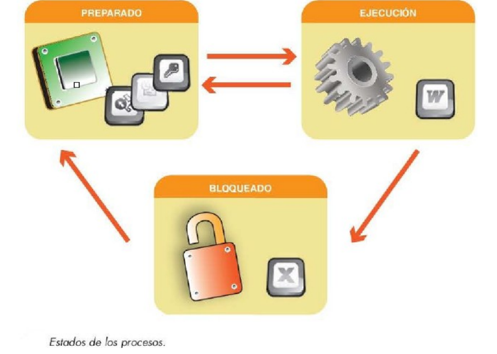

### Transición de los Procesos
* Una vez que un programa se ha lanzado y se ha convertido en proceso, puede atravesar varias fases o estados hasta que finaliza o termina.
* Cuando un proceso se lanza, nunca se ejecuta
directamente, sino que se coloca en la cola de procesos en un estado denominado preparado. Cuando la CPU le asigna su tiempo, el proceso pasa de preparado a ejecución. Estos dos estados se alternarán en caso de que se esté ejecutando más de un proceso en el sistema.
* Los cambios de estado en los que se puede encontrar
un proceso se denominan transiciones. Las transiciones o cambios de estado que pueden experimentar los procesos.
  * **Transición A (Ejecución $\rightarrow$ Bloqueado):** El programa necesita algún elemento, señal o dato de $E/S$ para continuar.
  * **Transición B (Ejecución $\rightarrow$ Preparado):** El proceso agota el tiempo (cuanto) concedido por la CPU y debe ceder el paso.
  * **Transición C (Preparado $\rightarrow$ Ejecución):** El planificador asigna un turno de CPU al proceso.
  * **Transición D (Bloqueado $\rightarrow$ Preparado):** Llega el dato/evento/señal esperada por el proceso.

  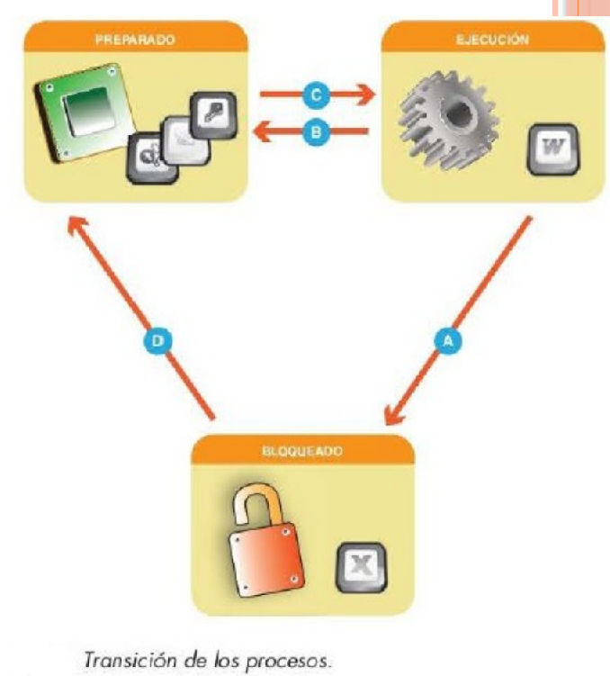

### Cambio de Contexto
* En un sistema multiproceso o multihebra, cuando un
proceso o hilo pasa de un estado a otro (por ejemplo, de espera a ejecución), lo que se producirá es un cambio de contexto.
* El cambio de contexto ocurre cuando un proceso/hilo pasa de un estado a otro:
  * **Parcial:** Entre hilos pertenecientes al mismo proceso.
  * **Completo:** Entre hilos de procesos distintos (requiere salvar/cargar estados de memoria, hardware, ficheros abiertos, etc., en los respectivos BCP/PCB).

  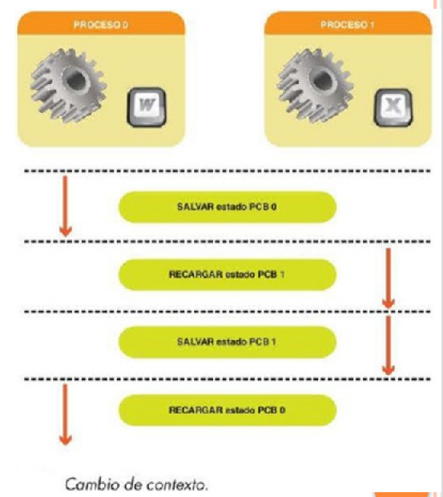

  ## Actividad: Algoritmos de Planificación
  * Busca información sobre los siguientes algoritmos de planificación comentados en la diapositiva anterior:
  * Round Robin
  * SRTF (Short Remaining Time First)
  * FCFS (First-Come, First-Served) o FIFO (Firs In First Out)
  * SJF (Shortest Job First)
  * Prioridad

---

<h2 id="algoritmo-pla"><u>6. Algoritmos de Planificación</u></h2>

### Tipos de Algoritmos
* **FIFO / FCFS (First In First Out / First-Come, First-Served):** Los procesos se atienden por estricto orden de llegada hasta que terminan. No expulsivo. Muy usado en colas de impresión.
* **Round Robin (RR):** Asigna a cada proceso de forma rotativa y equitativa un intervalo temporal de ejecución fijo (*quantum*). Utiliza internamente una cola FIFO.
* **SJF (Shortest Job First):** Selecciona el proceso con menor tiempo estimado de CPU de entre los preparados. En caso de empate, usa FIFO. No es expulsivo.
* **SRTF (Shortest Remaining Time First):** Variante expulsiva de SJF. Si llega un proceso cuyo tiempo restante estimado es menor que el tiempo que le queda al proceso en ejecución, este último es desalojado (cambio de contexto).

### Fórmulas y Criterios de Rendimiento
* Gracias a los algoritmos de planificación, especialmente en sistemas operativos multiproceso o en sistemas operativos en red, siempre y cuando se
ejecuten varios procesos en el mismo equipo, la CPU se encarga de asignar tiempos de ejecución a cada proceso según el tipo de algoritmo y la prioridad de cada proceso.
* En cada algoritmo sabremos para cada proceso:
  * $T_L$ (Tiempo de llegada/entrada): Momento en que entra al sistema.
  * $T_X$ (Tiempo de ejecución/ráfaga): Tiempo total que necesita de CPU.
  * $T_R$ (Tiempo de retorno o respuesta): $T_R = \text{Tiempo de fin} - T_L$.
  * $T_E$ (Tiempo de espera en cola de preparados):
    $$T_E = T_R - T_X$$
  * Se calculan los promedios ($\overline{T_R}$ y $\overline{T_E}$) para evaluar la eficiencia global.

* ***Tipos de Algoritmos de planificación:***
  * ***Criterios de rendimiento:***
  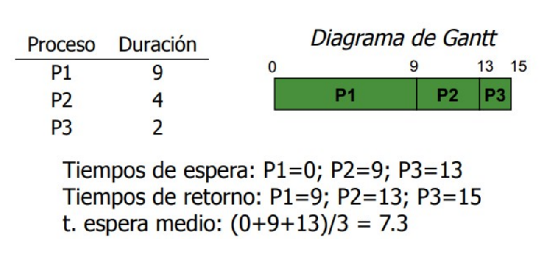

  * ***FIFO:***
  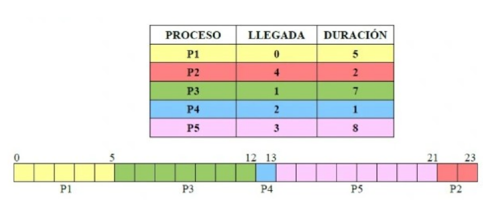

  * ***Round Robin (RR) quantum=3***
  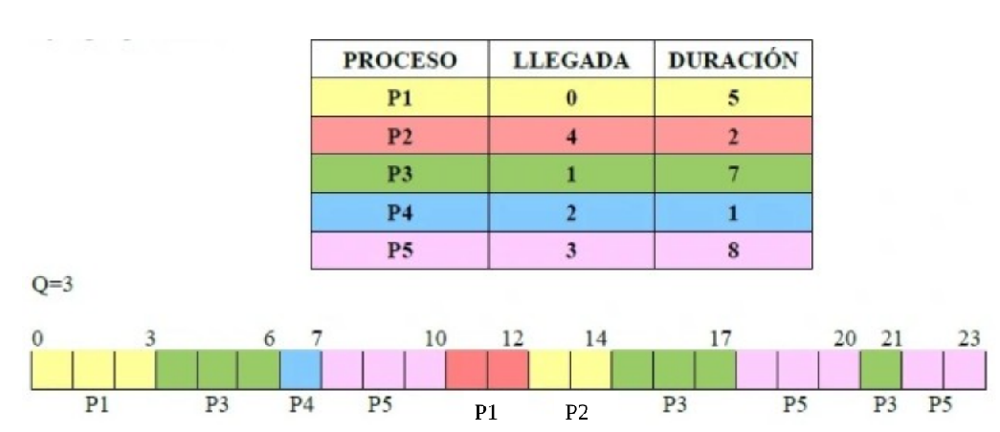

  * ***SRTF (Short Remaining Time First)***
  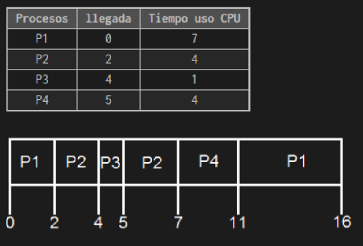

  * ***SJF:***
  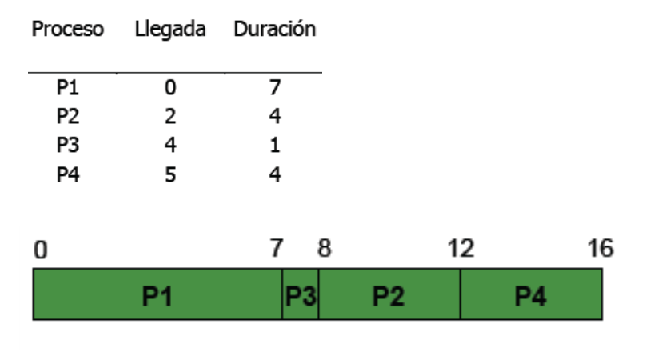

* ***Algoritmos de planificación con Prioridad:***  
  * ***FIFO (Cuanta más bajo sea el valor de la prioridad, mayor prioridad tiene el proceso)***
  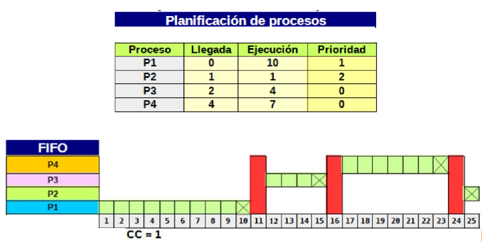

    

    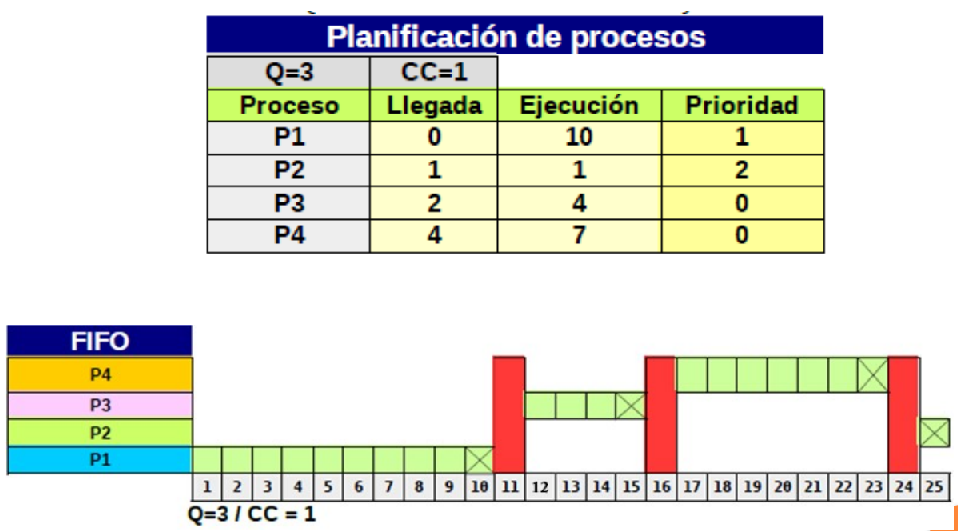

  ---

  * ***RR***
  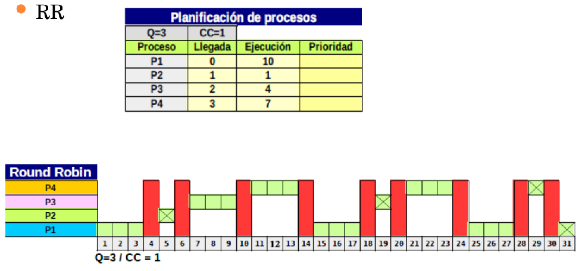

    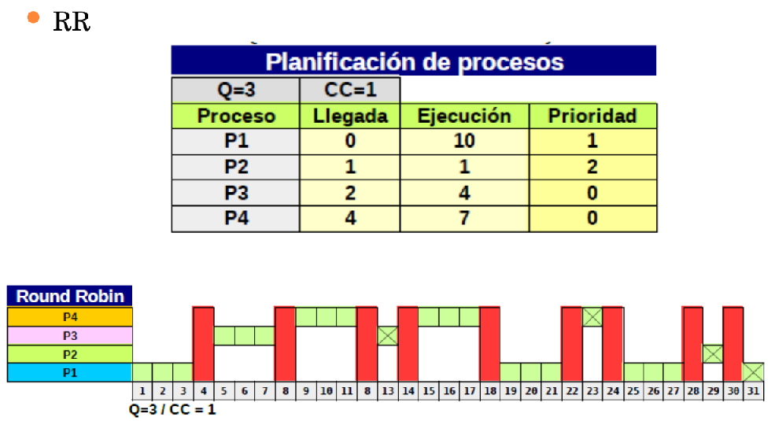

    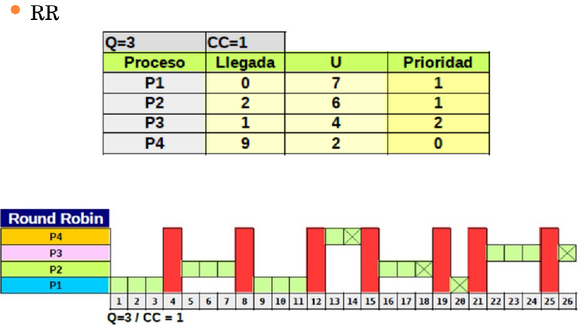

  ## Actividad 1
  * Realiza la planificación de los siguientes procesos utilizando algoritmo de planificación FIFO y Round Robin sin prioridades. El Quantum será de 3 unidades y el Cambio de contexto de 1 unidades.

  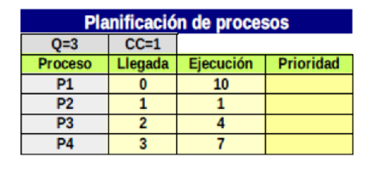

  ## Actividad 2
  * Realiza  la planificación de los siguientes procesos utilizando algoritmo de planificación Round Robin con prioridades. El Quantum será de 3 unidades y el Cambio de contexto de 1 unidades. Cuanta más bajo sea el valor de la prioridad, mayor prioridad tiene el proceso.

  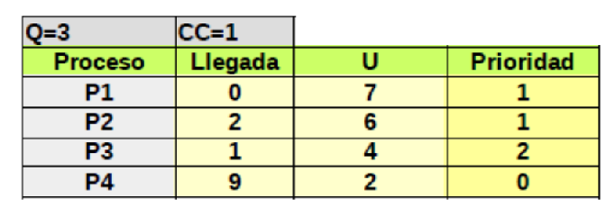

---

<h2 id="otro-admin"><u>7. Otros Módulos de Administración del SO</u></h2>

* **Gestión de memoria:** Asigna, administra y libera memoria RAM de forma segura. Implementa la **memoria virtual**, extendiendo el espacio RAM mediante almacenamiento secundario (disco duro).
* **Gestión de Entradas/Salidas ($E/S$):** Administra la interacción con hardware externo (pantallas, impresoras, discos, redes) de manera rápida y con el menor coste computacional posible.
* **Gestión de almacenamiento secundario:** Organiza los medios no volátiles para que la lectura y escritura se realicen de forma estructurada, segura y eficiente.
* **Gestión de la seguridad:** Evita fallos y accesos malintencionados garantizando servicio/disponibilidad, confidencialidad, integridad de datos, control de accesos y autenticidad.
* **Gestión de errores:** Maneja excepciones de software y fallos hardware protegiendo la integridad del sistema e informando al usuario.
* **Gestión de la interfaz de usuario:** Facilita la comunicación usuario-máquina mediante entornos de comandos (CLI) o gráficos (GUI).

* **El Sistema Operativo:** [https://www.youtube.com/watch?v=AaUELEqLcVk](https://www.youtube.com/watch?v=AaUELEqLcVk)

* **Funciones del Sistema Operativo:** [https://www.youtube.com/watch?v=y3Xi0ekq6_w](https://www.youtube.com/watch?v=y3Xi0ekq6_w)

---

<h2 id="clas-so"><u>8. Clasificación de Sistemas Operativos</u></h2>

* **Por número de procesos simultáneos:**
  * **Monotarea:** Solo ejecuta un proceso a la vez (ej.: MS-DOS).
  * **Multitarea:** Ejecuta varios procesos concurrentemente mediante reparto de CPU (ej.: Linux, Windows).
* **Por número de usuarios atendidos:**
  * **Monousuario:** Un solo usuario a la vez (ej.: MS-DOS, Windows 95).
  * **Multiusuario:** Varios usuarios concurrentes local o remotamente (ej.: Unix, Linux, Windows Server).
* **Por el tipo de procesamiento:**
  * **Tiempo Real:** Cumplen plazos estrictos de respuesta temporal (aviónica, centrales nucleares, automoción, medicina). Ejemplos: QNX, LynxOS.
  * **Tiempo Compartido / Interactivos:** Reparten el procesador en fracciones de tiempo dando la ilusión de uso exclusivo (ej.: Unix, Linux, Multics, OS/360).
  * **Por Lotes (*batch*):** Agrupan tareas y las procesan secuencialmente sin interacción humana (ej.: SCOPE en CDC 6600, EXEC II en UNIVAC 1107).
* **Por el tipo de interfaz:** Textuales (CLI) vs. Gráficos (GUI).
* **Por la forma de prestar servicios:** De escritorio/cliente, En red (servidores), Distribuidos (varios nodos actuando como un sistema unificado).
  
* **Atendiendo al sistema de interfaz empleado:**
    * ***Textuales:*** emplean un reportorio de comandos que se introducen en el sistema de forma escrita a través de un terminal de órdenes.
    * ***Gráficos:*** usan un conjunto de ventanas, botones y desplegables gráficos donde se representan los diferentes volúmenes, unidades y sistemas de ficheros de forma muy intuitiva. Los programas lanzados presentan una vista gráfica.

* **Atendiendo a la forma de ofrecer los servicios:**
  * ***Sistemas operativos cliente o de escritorio:*** Son sistemas operativos diseñados principalmente para ser utilizados en computadoras personales (PCs) o estaciones de trabajo por un solo usuario a la vez.Estos sistemas están optimizados para proporcionar una interfaz amigable y permitir a los usuarios ejecutar aplicaciones de propósito general, como navegadores web, suites ofimáticas, multimedia, y juegos. 
  * ***Sistemas operativos en red:*** Los sistemas operativos en red están diseñados para gestionar y coordinar múltiples equipos conectados en una red, proporcionando servicios a otros equipos (clientes) y facilitando la comunicación y el intercambio de recursos como archivos, impresoras o bases de datos.Son fundamentales en entornos empresariales y oficinas donde varios usuarios y dispositivos necesitan colaborar.
  * ***Sistemas operativos distribuidos:*** Un sistema operativo distribuido es un tipo de SO que gestiona un conjunto de computadores independientes (nodos) que están conectados a través de una red y actúan como un sistema unificado. Estos nodos colaboran para compartir recursos y tareas, presentando al usuario la ilusión de que está trabajando con un solo sistema.

  ## Actividad
  * Accede a las páginas web de https://blackberry.qnx.com y http://www.lynx.com .Lee ambas páginas y comenta qué usos tienen estos sistemas operativos.
  * Busca en Internet dos versiones de sistemas operativos únicamente textuales.

  ## Solución
  

  * Son SOs en tiempo real, se deben cumplir escrupulosamente los plazos de ejecución de los procesos. Ejemplos: aviónica, sistemas industriales, vehículos autónomos, instrumentación médica, instrumentación bélica, sistemas alerta en un central nuclear, etc.
  * Por ejemplo:
    * Ubuntu Server: no es un sistema operativo exclusivamente textual, pero suele instalarse y usarse en un entorno de solo texto, especialmente en entornos de servidor y administración de redes. Al instalarse, Ubuntu Server viene sin una interfaz gráfica de usuario (GUI) de forma predeterminada, lo que permite a los administradores de sistemas y desarrolladores interactuar con el sistema exclusivamente a través de la línea de comandos.
    * INX: es una distribución de Linux creada en 2007-2008, basada en Ubuntu, que está diseñada específicamente para ser usada exclusivamente en modo texto, sin interfaz gráfica. Se concibió como una herramienta educativa para ayudar a los usuarios, especialmente principiantes en Linux, a familiarizarse con el uso de la línea de comandos y comandos básicos del sistema.
    * MSDOS: Uno de los primeros sistemas ampliamente adoptados en la computación personal, especialmente en los años 80 y principios de los 90. Diseñado sin interfaz gráfica, DOS se controla únicamente a través de comandos escritos
  

---

<h2 id="arqui-so"><u>9. Arquitecturas de Sistemas Operativos</u></h2>

### 1. Arquitectura por Capas o Anillos
Modelo jerárquico concéntrico donde cada nivel solo interactúa con el contiguo:
$$\text{Hardware} \rightarrow \text{Núcleo} \rightarrow \text{Servicios} \rightarrow \text{Interfaz / Programas} \rightarrow \text{Usuario}$$
* *Ventaja:* Alto control, seguridad y organización.
* *Desventaja:* Lento y complejo por el paso entre niveles.

### 2. Kernel Monolítico
* Todas las funciones del SO (planificador, drivers, sistema de archivos, memoria, IPC) se ejecutan dentro del espacio del núcleo (*kernel space*).
* *Ventajas:* Máxima velocidad y comunicación directa entre componentes.
* *Desventajas:* Mantenimiento complejo y menor tolerancia a fallos (un error en un driver puede congelar todo el sistema). Ejemplo: Ubuntu / Linux.

  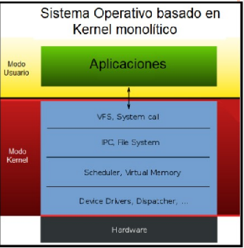

### 3. Microkernel
* El núcleo se reduce a lo estrictamente indispensable: memoria básica, planificación básica e IPC.
* Drivers, servidores de red y sistemas de ficheros se ejecutan fuera del núcleo en **modo usuario**.
* Las aplicaciones se comunican con los servidores enviando mensajes gestionados por el micronúcleo.
* *Ventajas:* Alta seguridad, estabilidad, modularidad y fácil actualización. Ejemplo: MINIX.

  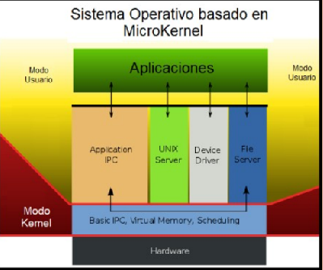

### 4. Kernel Híbrido
* Combina elementos de microkernel y monolítico. Mantiene drivers y subsistemas críticos en modo kernel para no perder rendimiento, organizando el resto de forma modular. Ejemplos: Windows NT, macOS.

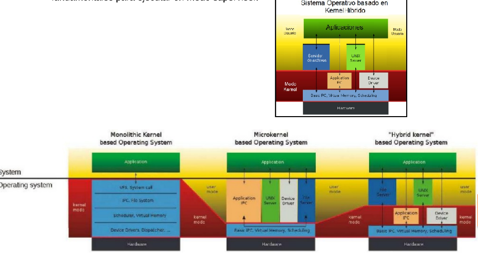

*  Artículo “Cómo es el kernel de Windows y cuáles son sus diferencias con el de Linux”: [https://www.genbeta.com/a-fondo/como-es-el-kernel-de-windows-y-cuales-son-sus-diferencias-con-el-de-linux](https://www.genbeta.com/a-fondo/como-es-el-kernel-de-windows-y-cuales-son-sus-diferencias-con-el-de-linux)

---

<h2 id="ver-dis"><u>9. Versiones y Distribuciones Principales</u></h2>

* **Microsoft Windows:**
  * *Escritorio (ej. Windows 10):* Home, Pro, Enterprise, IoT, Education, Pro for Workstations.
  * *Servidor (ej. Windows Server 2019):* Datacenter, Standard, Essentials.
* **GNU/Linux:**
  * *Servidores:* Red Hat Enterprise Linux, Ubuntu Server, CentOS, SUSE Linux Enterprise Server, Debian, FreeBSD (*Unix*).
  * *Escritorio:* Ubuntu, Linux Mint (genéricos); Arch Linux, Manjaro; Kali Linux, Tails (seguridad/privacidad); Android (móviles).
* **Apple:** macOS (escritorio), iOS (smartphones).

---

<h2 id="inst-part"><u>10. Instalación, Particionamiento y Arranque</u></h2>

### Consideraciones Previas
* Verificación de requisitos mínimos y recomendados.
    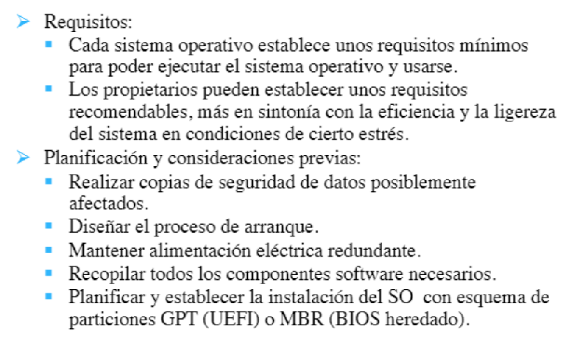
* Realización de copias de seguridad.
* Definición del esquema de particiones: MBR vs GPT. MBR y GPT (tabla de particiones):
  - [https://www.youtube.com/watch?v=sLnllw6rALA](https://www.youtube.com/watch?v=sLnllw6rALA)
  - [https://www.youtube.com/watch?v=eH-N4XiNCO0](https://www.youtube.com/watch?v=eH-N4XiNCO0)

### Instalación de un Sistema Operativo
* Instalar Ubuntu en VirtualBox: [https://www.youtube.com/watch?v=qH9JuCjCKow](https://www.youtube.com/watch?v=qH9JuCjCKow)

 

  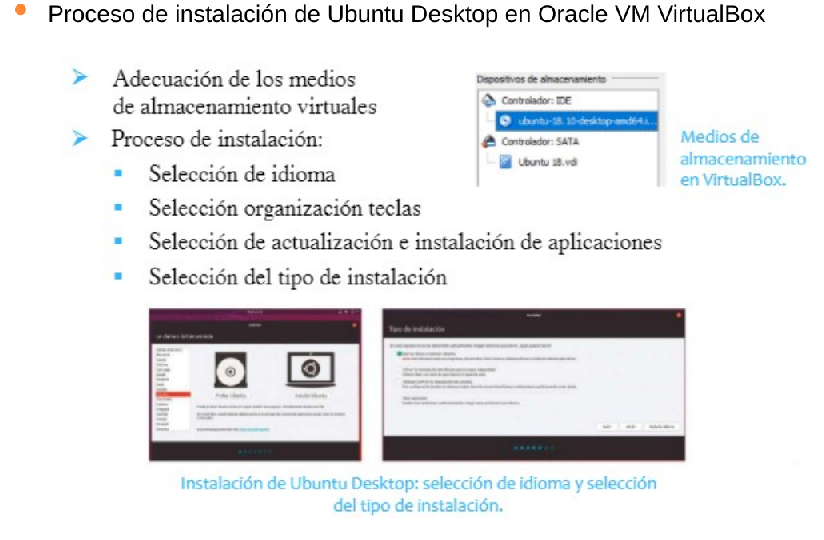

  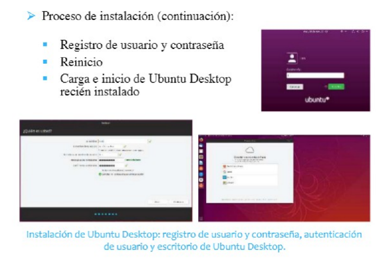

  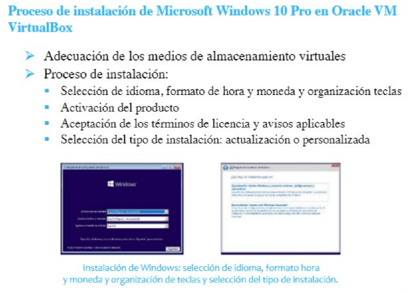

  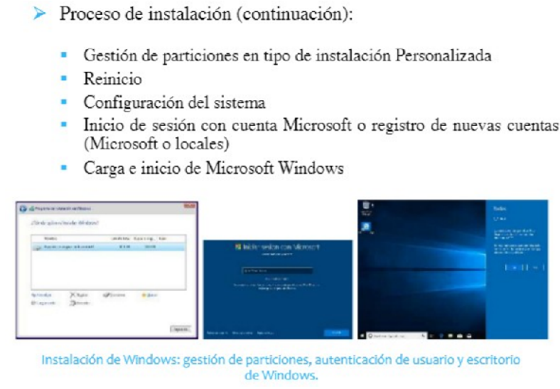

 

* Instalar Windows 10 en VirtualBox: [https://www.youtube.com/watch?v=gfM9uMT575wlist=PLG1hKOHdoXkvF6Q5VcGZrRSeE7Eu38s3J](https://www.youtube.com/watch?v=gfM9uMT575wlist=PLG1hKOHdoXkvF6Q5VcGZrRSeE7Eu38s3J)
  
* CÓMO tener DUAL BOOT de forma FÁCIL - WINDOWS +
LINUX: [https://www.youtube.com/watch?v=Rj9bzqP5egU](https://www.youtube.com/watch?v=Rj9bzqP5egU)

* Instalar Complemento Guest Additions
  * [https://www.youtube.com/watch?v=DH1TDDX7NmE](https://www.youtube.com/watch?v=DH1TDDX7NmE)
  * [https://www.youtube.com/watch?v=kwHmO6a35j8](https://www.youtube.com/watch?v=kwHmO6a35j8)
  * En clase al darle a insertar Guest Additions CD image no funciona hay que:
    * Ir a la página de descarga de VirtualBox, que es [https://download.virtualbox.org/virtualbox/](https://download.virtualbox.org/virtualbox/)
    * buscar la versión que tenemos instalada de VirtualBox (por ejemplo 7.0.16)
    * Descarga manualmente la iso del complemento, por ejemplo: **VBoxGuestAdditions_7.0.16.iso**
    * Inserta manualmente la unidad CD en la VM
    * Si la VM está en ejecución, está en el menú Devices > Optical Drives > Choose a disk file
    * Luego selecciona el iso que acabas de descargar
    * Seguir ya los pasos indicados en el video

* **Instalación desatendida**
  * En ocasiones los SO a través de herramientas específicas puedes simplificar su instalación reduciendo al mínimo la intervención del usuario.
  * Instalar Windows 10 en VirtualBox 7 en modo desatendido: [https://www.youtube.com/watch?v=C08MiyILxwM](https://www.youtube.com/watch?v=C08MiyILxwM)
  * Como INSTALAR Windows 11 en Virtualbox PASO A PASO - INSTALACION DESATENDIDA
    * [https://www.youtube.com/watch?v=zHctGd2p4B0](https://www.youtube.com/watch?v=zHctGd2p4B0)
  * Herramienta NTLite
    * [https://www.youtube.com/watch?v=dZUZC4eyP-Y](https://www.youtube.com/watch?v=dZUZC4eyP-Y)
  * Herramienta Kickstart
    * [https://www.youtube.com/watch?v=fsR3rxsYLSA](https://www.youtube.com/watch?v=fsR3rxsYLSA)

---

<h2 id="org-almacen"><u>11. Organización del espacio de almacenamiento</u></h2>

* El formato o sistema de archivos de las particiones no debe ser confundido con el tipo de particiones. Independientemente del sistema de archivos de una partición (FAT, ext3/4, NTFS, etc.), existen tres tipos diferentes de particiones:
  * **Partición primaria.** Es el espacio de disco imprescindible para poder empezar a utilizar el espacio de almacenamiento. Solo puede haber tres de éstas, y no en todos los sistemas de archivos. **En este tipo de particiones es donde se suele instalar el sistema operativo.**
  * Cuando vamos a instalar un sistema operativo, es normal y conveniente instalarlo en una de las posibles particiones primarias que tengamos en el disco. No es normal instalar un sistema operativo en particiones que no sean de este tipo, especialmente debido a que las particiones que no son primarias, no suelen ser arrancables.
  * **Partición extendida.** Es otro tipo de partición que actúa como una partición primaria sin serlo. Se utiliza para contener infinidad de unidades o particiones lógicas en su interior. Fue ideada para romper la limitación de tres particiones primarias en un solo disco físico. Solo puede existir una partición de este tipo por disco.
  * **Unidad o partición lógica.** Ocupa un trozo de partición extendida o la totalidad de la misma, la cual se ha formateado con un tipo específico de sistema de archivos (FAT32, NTFS, ext3/4, etc.) y a la que se le ha asignado una unidad. Siempre nos referiremos a este tipo de particiones como unidades lógicas 
  * [https://www.xataka.com/basics/particiones-de-disco-duro-que-son-y-como-hacerlas-en-windows](https://www.xataka.com/basics/particiones-de-disco-duro-que-son-y-como-hacerlas-en-windows)
  
    

### MBR frente a GPT
| Característica | MBR (Master Boot Record) | GPT (GUID Partition Table) |
| :--- | :--- | :--- |
| **Estándar firmware** | BIOS heredado (Legacy BIOS) | UEFI |
| **Límite de particiones** | 4 primarias (o 3 primarias + 1 extendida con lógicas) | Hasta 128 particiones |
| **Capacidad máxima** | Hasta 2 TB | Hasta 9.4 ZB ($10^{21}$ bytes) |
| **Seguridad / Respaldo** | Un solo sector al inicio; vulnerable si se corrompe | Tablas duplicadas al inicio y al final con verificación CRC |

### Estructura típica de particiones Windows:
* **En UEFI (GPT):** Partición EFI / ESP (100–300 MB, FAT32), Partición MSR (16–128 MB), Partición de Windows C: (NTFS), Partición de recuperación (500 MB–1 GB, NTFS). Esquema predeterminado incluye:
  * Partición EFI (ESP - EFI System Partition):
    * Tamaño: Generalmente entre 100 y 300 MB.
    * Propósito: Contiene los archivos necesarios para el arranque UEFI, como los gestores de arranque y configuraciones.
    * Formato: FAT32.

  * Partición Reservada de Microsoft (MSR):
     * Tamaño: 16 MB (en discos menores de 16 TB) o 128 MB (en discos más grandes).
    * Propósito: Reservada para el sistema operativo, no tiene un uso directo por el usuario.
    * Formato: No está formateada ni visible para el usuario.
  
  * Partición del Sistema o de Windows (C:):
    * Tamaño: Variable, según el tamaño del disco y las necesidades del usuario.
    * Propósito: Almacena los archivos del sistema operativo, programas y datos del usuario.
    * Formato: NTFS.
  
  * Partición de Recuperación (opcional):
    * Tamaño: Generalmente entre 500 MB y 1 GB.
    * Propósito: Contiene herramientas de recuperación y diagnóstico de Windows.
    * Formato: NTFS.

* **En BIOS (MBR - Master Boot Record):** Partición reservada del sistema (100–500 MB, NTFS, aloja BOOTMGR), Partición del sistema C: (NTFS). Las particiones típicas son las siguientes:
  * Partición del Sistema Reservada (System Reserved):
    * Tamaño: Generalmente 500 MB (en Windows 10 y posteriores) o 100 MB (en versiones anteriores).
    * Propósito: 
      * Contiene los archivos de arranque de Windows (incluyendo el gestor de arranque, BOOTMGR).
      * Almacena los archivos de recuperación del sistema.
    * Formato: NTFS.
    * No se asigna una letra de unidad y está oculta para el usuario.
  * Partición del Sistema o Windows (C:):
    * Tamaño: Variable, según el tamaño del disco y las necesidades del usuario.
    * Propósito: Almacena los archivos principales del sistema operativo, programas y datos del usuario.
    * Formato: NTFS.

  * En equipos con modo heredado, no se crea una partición reservada de Microsoft (MSR) ni una partición EFI (ya que estas son exclusivas del arranque UEFI). Si el disco es más grande de 2 TB, solo se puede usar la capacidad hasta ese límite, ya que MBR no admite más espacio.

  ## Actividad
  * Averiguar el esquema de particionamiento de un volumen en Windows y en Linux

### Gestores de Arranque
* **Windows:**
  * Componentes: `bootmgr` (Windows Boot Manager) y almacén de datos BCD (`Boot Configuration Data`), configurable con la herramienta `bcdedit`.
  * `bootmgr` ejecuta el cargador `winload.exe`, y este transfiere el control al núcleo `ntoskrnl.exe`.
* **Linux:**
  * Gestores: GRUB 2, LILO, systemd-boot.
  * Configuración en `/boot/grub/grub.cfg`, parametrizado desde `/etc/default/grub` y `/etc/grub.d/`.
  * Carga el archivo de imagen del kernel `/boot/vmlinuz-<versión>` e inicia `init` o `systemd`.

---

<h2 id="mant-gest"><u>12. Mantenimiento y Gestión de Paquetes</u></h2>

### Actualizaciones del Sistema Operativo
* **Modos de gestión:** Automática, semiautomática o manual.
* **Windows Update:** Clasifica en Críticas/Importantes, Recomendadas y Opcionales. Permite pausar actualizaciones y configurar horas activas.

  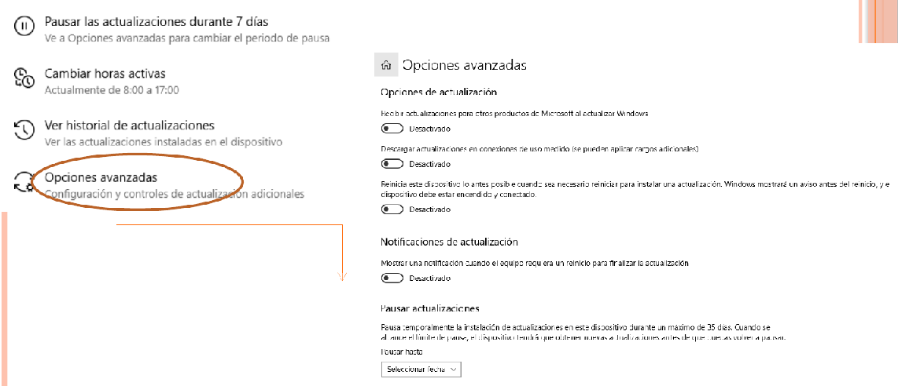

* **Ubuntu (Software y actualizaciones):** Clasifica en Actualizaciones de seguridad, Recomendadas y Sin asistencia técnica.

  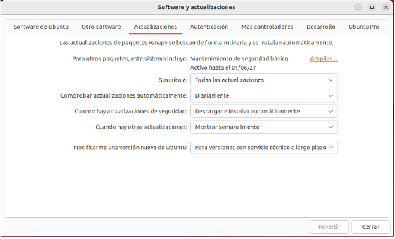

#### Administración de las actualizaciones

  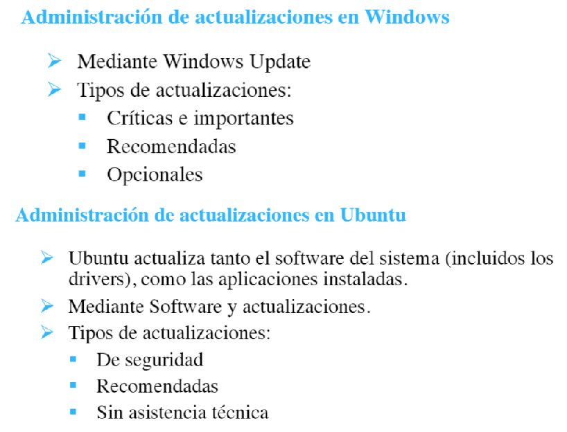

  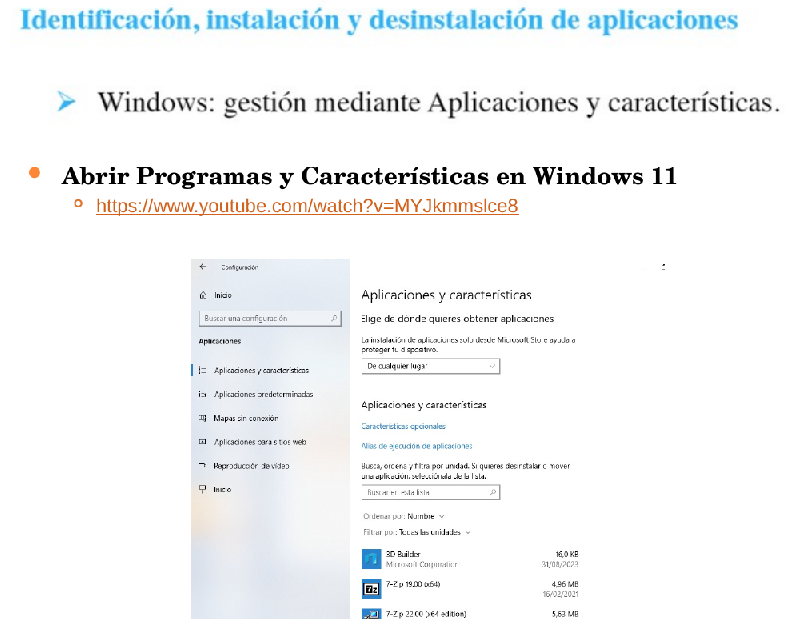

  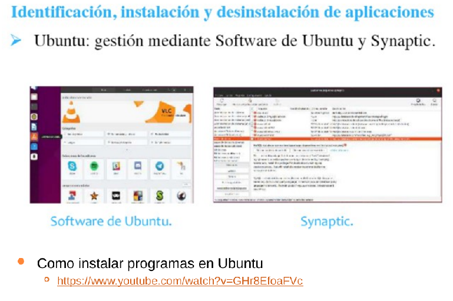

### Gestión de Aplicaciones en Linux (Comandos `apt`)
* `apt install <paquete>`: Instala un nuevo paquete.
* `apt reinstall <paquete>`: Reinstala el paquete reparando posibles inconsistencias.
* `apt remove <paquete>`: Elimina el software conservando archivos de configuración.
* `apt remove --purge <paquete>`: Desinstala por completo el paquete y sus ficheros de configuración.
* `apt update`: Actualiza la lista de repositorios y paquetes disponibles.
* `apt upgrade`: Descarga e instala las versiones más recientes de los paquetes del sistema.
* `apt dist-upgrade`: Actualizaciones avanzadas que resuelven cambios de dependencias y versiones de distribución.
* *Herramientas gráficas:* Software de Ubuntu, Synaptic Package Manager.

  ## Actividad
  * Instala el Synaptic Package Manager y mira las diferencias que tiene con respecto al centro de Software de Ubuntu.
